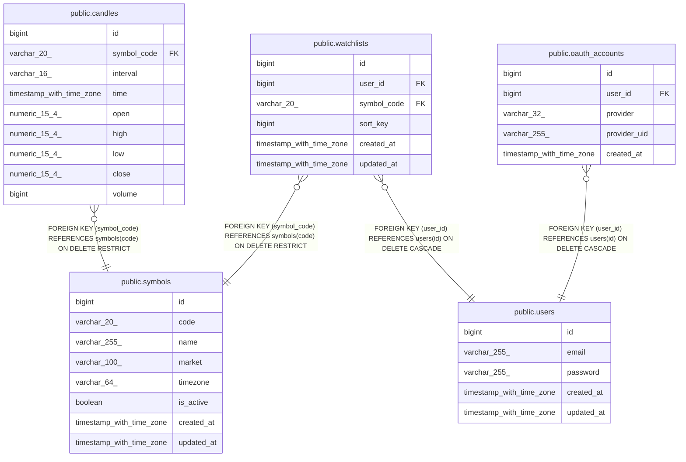

# app

## Tables

| Name | Columns | Comment | Type |
| ---- | ------- | ------- | ---- |
| [public.users](public.users.md) | 5 |  | BASE TABLE |
| [public.candles](public.candles.md) | 9 |  | BASE TABLE |
| [public.symbols](public.symbols.md) | 8 |  | BASE TABLE |
| [public.watchlists](public.watchlists.md) | 6 |  | BASE TABLE |
| [public.oauth_accounts](public.oauth_accounts.md) | 5 |  | BASE TABLE |

## Relations

---

> Generated by [tbls](https://github.com/k1LoW/tbls)
