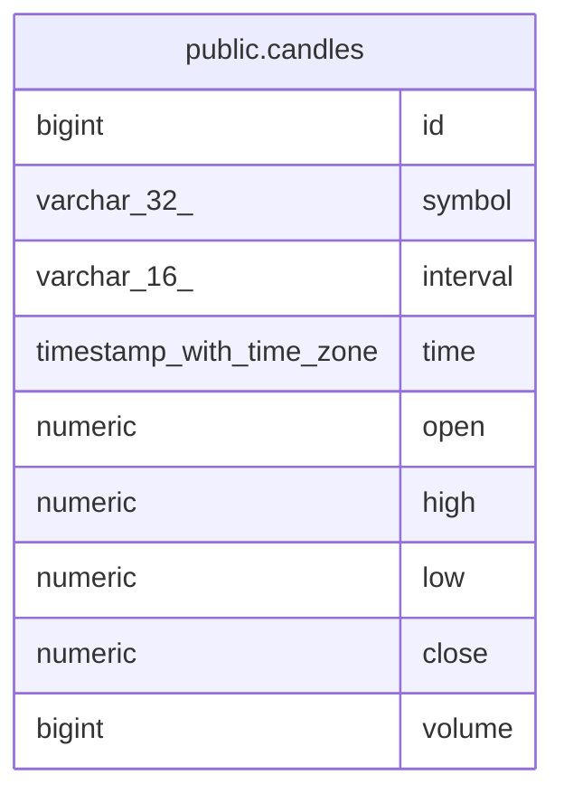

# public.candles

## Columns

| Name | Type | Default | Nullable | Children | Parents | Comment |
| ---- | ---- | ------- | -------- | -------- | ------- | ------- |
| id | bigint | nextval('candles_id_seq'::regclass) | false |  |  |  |
| symbol | varchar(32) |  | false |  |  |  |
| interval | varchar(16) |  | false |  |  |  |
| time | timestamp with time zone |  | false |  |  |  |
| open | numeric |  | false |  |  |  |
| high | numeric |  | false |  |  |  |
| low | numeric |  | false |  |  |  |
| close | numeric |  | false |  |  |  |
| volume | bigint | 0 | false |  |  |  |

## Constraints

| Name | Type | Definition |
| ---- | ---- | ---------- |
| candles_pkey | PRIMARY KEY | PRIMARY KEY (id) |

## Indexes

| Name | Definition |
| ---- | ---------- |
| candles_pkey | CREATE UNIQUE INDEX candles_pkey ON public.candles USING btree (id) |
| candle_sym_int_time | CREATE UNIQUE INDEX candle_sym_int_time ON public.candles USING btree (symbol, "interval", "time") |

## Relations

---

> Generated by [tbls](https://github.com/k1LoW/tbls)
