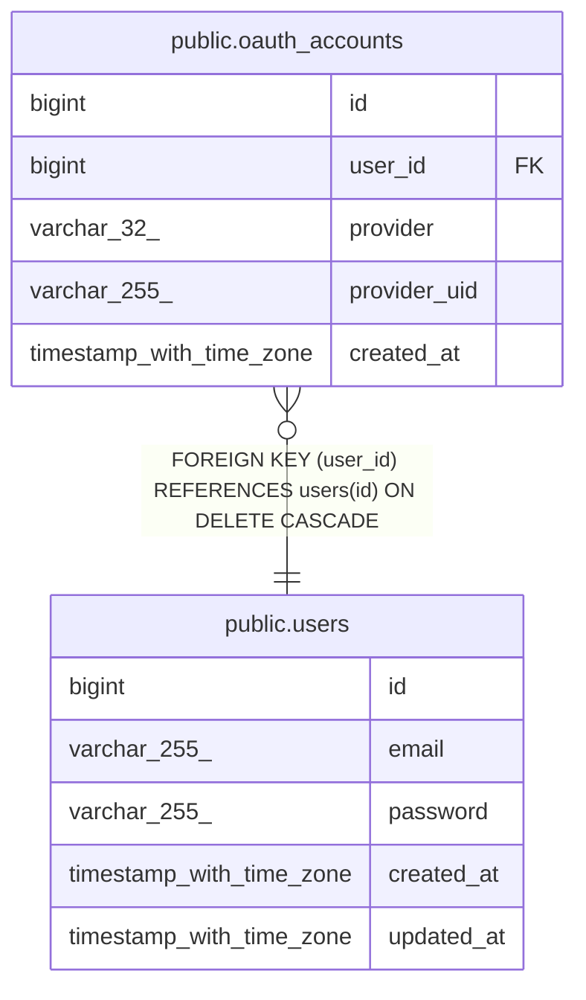

# public.oauth_accounts

## Columns

| Name | Type | Default | Nullable | Children | Parents | Comment |
| ---- | ---- | ------- | -------- | -------- | ------- | ------- |
| id | bigint | nextval('oauth_accounts_id_seq'::regclass) | false |  |  |  |
| user_id | bigint |  | false |  | [public.users](public.users.md) |  |
| provider | varchar(32) |  | false |  |  |  |
| provider_uid | varchar(255) |  | false |  |  |  |
| created_at | timestamp with time zone |  | false |  |  |  |

## Constraints

| Name | Type | Definition |
| ---- | ---- | ---------- |
| fk_oauth_accounts_user | FOREIGN KEY | FOREIGN KEY (user_id) REFERENCES users(id) ON DELETE CASCADE |
| oauth_accounts_pkey | PRIMARY KEY | PRIMARY KEY (id) |

## Indexes

| Name | Definition |
| ---- | ---------- |
| oauth_accounts_pkey | CREATE UNIQUE INDEX oauth_accounts_pkey ON public.oauth_accounts USING btree (id) |
| idx_oauth_provider_uid | CREATE UNIQUE INDEX idx_oauth_provider_uid ON public.oauth_accounts USING btree (provider, provider_uid) |
| idx_oauth_accounts_user_id | CREATE INDEX idx_oauth_accounts_user_id ON public.oauth_accounts USING btree (user_id) |

## Relations

---

> Generated by [tbls](https://github.com/k1LoW/tbls)
