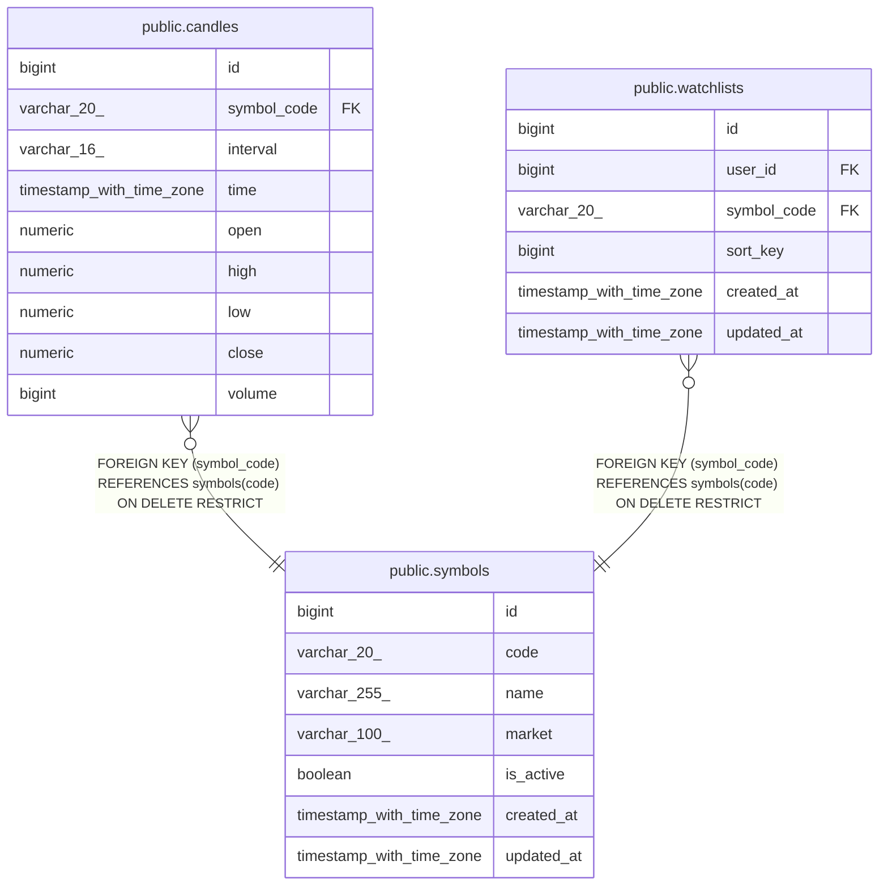

# public.symbols

## Columns

| Name | Type | Default | Nullable | Children | Parents | Comment |
| ---- | ---- | ------- | -------- | -------- | ------- | ------- |
| id | bigint | nextval('symbols_id_seq'::regclass) | false |  |  |  |
| code | varchar(20) |  | false | [public.candles](public.candles.md) [public.watchlists](public.watchlists.md) |  |  |
| name | varchar(255) |  | false |  |  |  |
| market | varchar(100) |  | false |  |  |  |
| is_active | boolean | true | false |  |  |  |
| created_at | timestamp with time zone |  | true |  |  |  |
| updated_at | timestamp with time zone |  | true |  |  |  |

## Constraints

| Name | Type | Definition |
| ---- | ---- | ---------- |
| symbols_pkey | PRIMARY KEY | PRIMARY KEY (id) |

## Indexes

| Name | Definition |
| ---- | ---------- |
| symbols_pkey | CREATE UNIQUE INDEX symbols_pkey ON public.symbols USING btree (id) |
| idx_symbols_code | CREATE UNIQUE INDEX idx_symbols_code ON public.symbols USING btree (code) |

## Relations

---

> Generated by [tbls](https://github.com/k1LoW/tbls)
