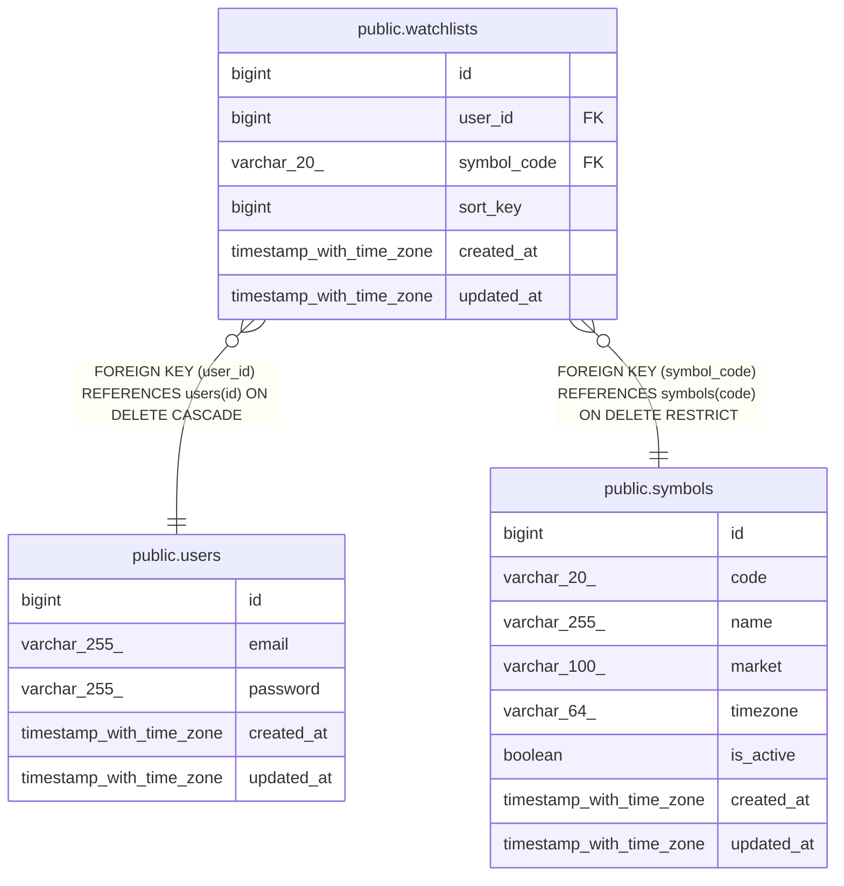

# public.watchlists

## Columns

| Name | Type | Default | Nullable | Children | Parents | Comment |
| ---- | ---- | ------- | -------- | -------- | ------- | ------- |
| id | bigint | nextval('watchlists_id_seq'::regclass) | false |  |  |  |
| user_id | bigint |  | false |  | [public.users](public.users.md) |  |
| symbol_code | varchar(20) |  | false |  | [public.symbols](public.symbols.md) |  |
| sort_key | bigint | 0 | false |  |  |  |
| created_at | timestamp with time zone |  | false |  |  |  |
| updated_at | timestamp with time zone |  | false |  |  |  |

## Constraints

| Name | Type | Definition |
| ---- | ---- | ---------- |
| fk_watchlists_user | FOREIGN KEY | FOREIGN KEY (user_id) REFERENCES users(id) ON DELETE CASCADE |
| fk_watchlists_symbol | FOREIGN KEY | FOREIGN KEY (symbol_code) REFERENCES symbols(code) ON DELETE RESTRICT |
| watchlists_pkey | PRIMARY KEY | PRIMARY KEY (id) |

## Indexes

| Name | Definition |
| ---- | ---------- |
| watchlists_pkey | CREATE UNIQUE INDEX watchlists_pkey ON public.watchlists USING btree (id) |
| idx_watchlist_user_sort_key | CREATE UNIQUE INDEX idx_watchlist_user_sort_key ON public.watchlists USING btree (user_id, sort_key) |
| idx_watchlist_user_symbol | CREATE UNIQUE INDEX idx_watchlist_user_symbol ON public.watchlists USING btree (user_id, symbol_code) |
| idx_watchlists_symbol_code | CREATE INDEX idx_watchlists_symbol_code ON public.watchlists USING btree (symbol_code) |

## Relations

---

> Generated by [tbls](https://github.com/k1LoW/tbls)
