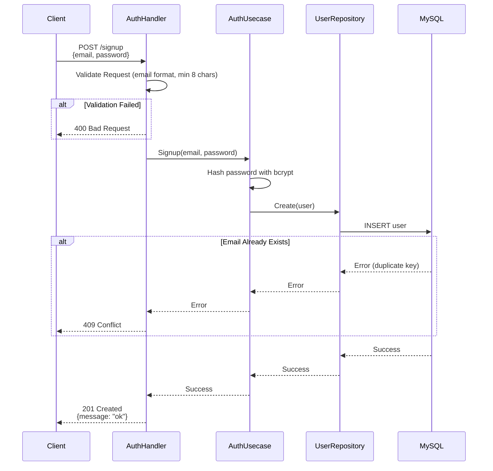
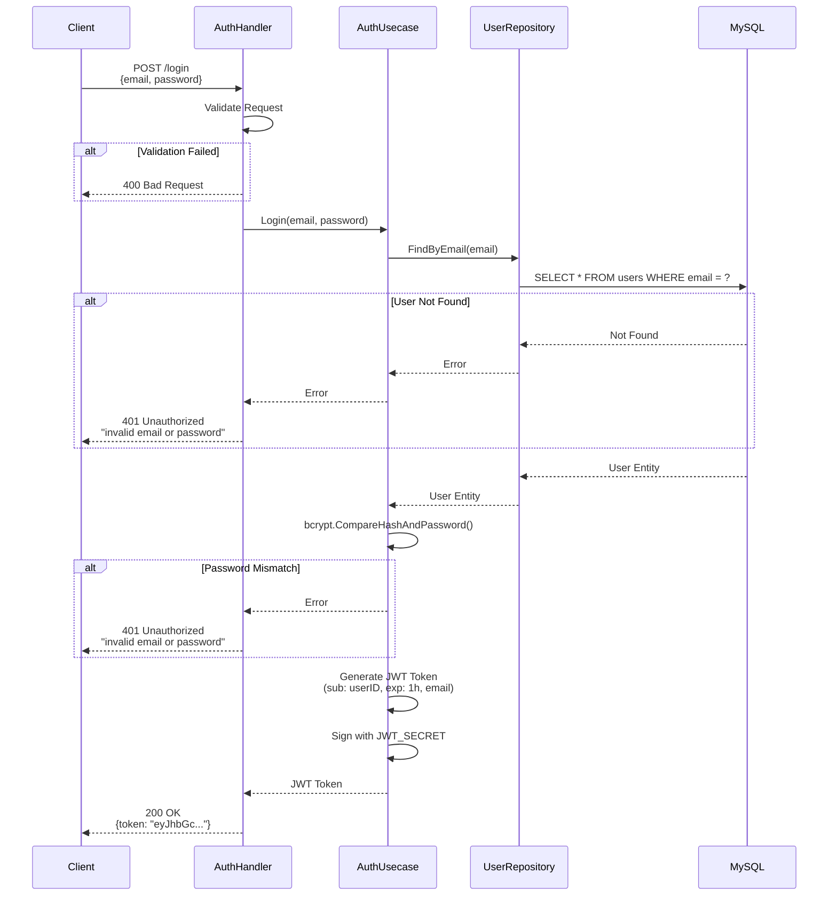
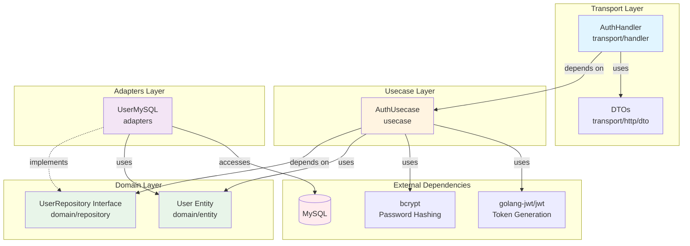

# Auth Feature

## Overview

The Auth feature provides a JWT (JSON Web Token) based authentication system. It handles user registration, login, and JWT token issuance and verification.

### Key Features

- **User Signup**: Register new users with email and password
- **Login**: Authenticate credentials and issue JWT tokens
- **Password Encryption**: Secure password hashing with bcrypt
- **JWT Authentication**: Issue JWT tokens valid for 1 hour to control access to protected endpoints

## Sequence Diagrams

### User Signup Flow



### Login Flow



## API Specification

### POST /signup

Registers a new user.

**Request**
```json
{
  "email": "user@example.com",
  "password": "password123"
}
```

**Validation Rules**
- `email`: Required, valid email format
- `password`: Required, minimum 8 characters

**Response**

- **201 Created** - Registration successful
  ```json
  {
    "message": "ok"
  }
  ```

- **400 Bad Request** - Validation error
  ```json
  {
    "error": "Key: 'SignupReq.Password' Error:Field validation for 'Password' failed on the 'min' tag"
  }
  ```

- **409 Conflict** - Email address already in use
  ```json
  {
    "error": "failed to hash password: ..."
  }
  ```

### POST /login

Authenticates a user and issues a JWT token.

**Request**
```json
{
  "email": "user@example.com",
  "password": "password123"
}
```

**Validation Rules**
- `email`: Required, valid email format
- `password`: Required

**Response**

- **200 OK** - Authentication successful
  ```json
  {
    "token": "eyJhbGciOiJIUzI1NiIsInR5cCI6IkpXVCJ9..."
  }
  ```

  **JWT Claims:**
  - `sub`: User ID (uint)
  - `email`: User's email address
  - `iat`: Issued at (Unix timestamp)
  - `exp`: Expiration time (issued at + 1 hour)

- **400 Bad Request** - Validation error
  ```json
  {
    "error": "Key: 'LoginReq.Email' Error:Field validation for 'Email' failed on the 'email' tag"
  }
  ```

- **401 Unauthorized** - Authentication failed (invalid email or password)
  ```json
  {
    "error": "invalid email or password"
  }
  ```

## Dependency Diagram



### Dependency Explanation

#### Transport Layer ([transport/handler/auth_handler.go](transport/handler/auth_handler.go))
- **AuthHandler**: Processes HTTP requests and calls AuthUsecase
- **DTOs** ([transport/http/dto/](transport/http/dto/)): Define request/response data structures
  - [SignupReq](transport/http/dto/signup_request.go): User registration request
  - [LoginReq](transport/http/dto/login_request.go): Login request

#### Usecase Layer ([usecase/auth_usecase.go](usecase/auth_usecase.go))
- **AuthUsecase**: Implements authentication business logic
  - Password hashing (bcrypt)
  - Password verification
  - JWT token generation and signing

#### Domain Layer
- **User Entity** ([domain/entity/user.go](domain/entity/user.go)): User domain model
- **UserRepository Interface** ([domain/repository/user_repository.go](domain/repository/user_repository.go)): Abstract repository interface
  - `Create(user)`: Create user
  - `FindByEmail(email)`: Find user by email address
  - `FindByID(id)`: Find user by ID

#### Adapters Layer ([adapters/user_mysql.go](adapters/user_mysql.go))
- **UserMySQL**: MySQL implementation of UserRepository (using GORM)

### Architectural Characteristics

1. **Clean Architecture**: Domain layer is independent of infrastructure layer
2. **Dependency Inversion**: Usecase depends on Repository interface, not concrete implementations
3. **Security**:
   - Passwords are hashed with bcrypt before storage
   - JWT tokens are signed with HS256 algorithm
   - Signing uses `JWT_SECRET` environment variable

## Directory Structure

```
auth/
├── README.md                          # This file
├── domain/
│   ├── entity/
│   │   └── user.go                   # User entity definition
│   └── repository/
│       └── user_repository.go        # UserRepository interface
├── usecase/
│   ├── auth_usecase.go               # Authentication business logic
│   └── auth_usecase_test.go          # Usecase tests
├── adapters/
│   ├── user_mysql.go                 # MySQL repository implementation
│   └── user_mysql_test.go            # Repository tests
└── transport/
    ├── handler/
    │   ├── auth_handler.go           # HTTP handlers
    │   └── auth_handler_test.go      # Handler tests
    └── http/dto/
        ├── signup_request.go         # Signup request DTO
        └── login_request.go          # Login request DTO
```

## Testing

### Usecase Tests

```bash
go test ./internal/feature/auth/usecase/... -v
```

### Handler Tests

```bash
go test ./internal/feature/auth/transport/handler/... -v
```

### Repository Tests

```bash
go test ./internal/feature/auth/adapters/... -v
```

### All Tests

```bash
go test ./internal/feature/auth/... -v -race -cover
```

## Environment Variables

| Variable | Description | Required |
|----------|-------------|----------|
| `JWT_SECRET` | Secret key for signing JWT tokens | ✅ |

**Configuration Example** (`.env.docker`):
```
JWT_SECRET=your-super-secret-key-change-this-in-production
```

## Security Considerations

1. **Password Hashing**: Uses bcrypt (default cost: 10)
2. **JWT Expiration**: Automatically expires after 1 hour
3. **Error Messages**: Login failures return unified "invalid email or password" message (prevents enumeration attacks)
4. **JWT_SECRET**: Managed via environment variable; use a strong secret key in production

## Future Enhancements

- Refresh token implementation
- Password reset functionality
- Email verification
- Two-factor authentication (2FA)
- OAuth2 provider integration
