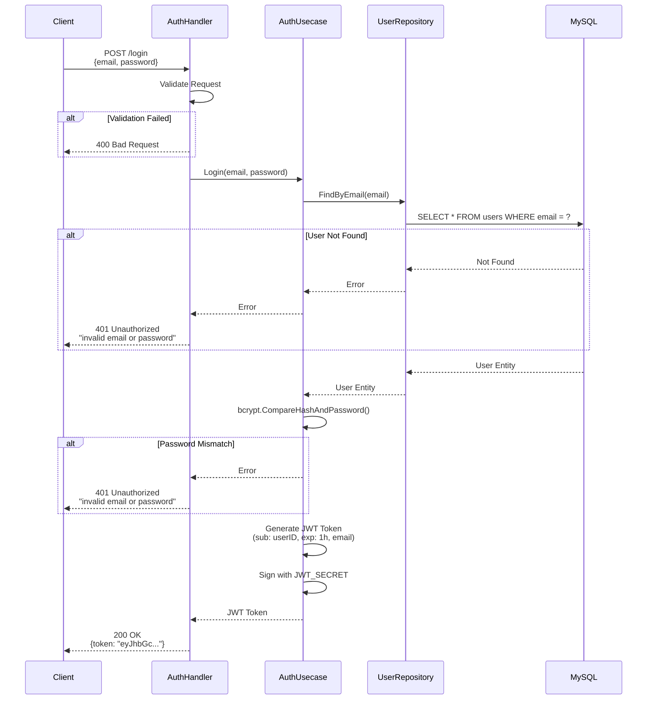
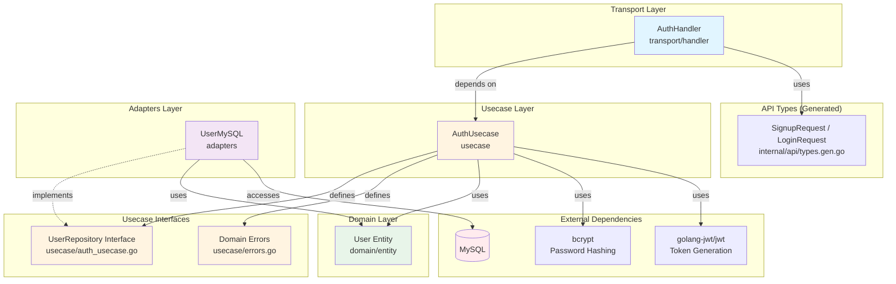

# Auth フィーチャー

## 概要

Auth フィーチャーは、JWT（JSON Web Token）ベースの認証システムを提供します。ユーザー登録、ログイン、JWTトークンの発行・検証を処理します。

### 主な機能

- **ユーザー登録（Signup）**: メールアドレスとパスワードで新規ユーザーを登録
- **ログイン**: 認証情報を検証し、JWTトークンを発行
- **パスワード暗号化**: bcryptによる安全なパスワードハッシュ化
- **JWT認証**: 保護エンドポイントへのアクセス制御用に有効期限1時間のJWTトークンを発行

## シーケンス図

### ユーザー登録フロー

```mermaid
sequenceDiagram
    participant Client
    participant Handler as AuthHandler
    participant Usecase as AuthUsecase
    participant Repository as UserRepository
    participant DB as MySQL

    Client->>Handler: POST /signup<br/>{email, password}
    Handler->>Handler: Validate Request (email format, min 8 chars)

    alt Validation Failed
        Handler-->>Client: 400 Bad Request
    end

    Handler->>Usecase: Signup(email, password)
    Usecase->>Usecase: Hash password with bcrypt
    Usecase->>Repository: Create(user)
    Repository->>DB: INSERT user

    alt Email Already Exists
        DB-->>Repository: Error (duplicate key)
        Repository-->>Usecase: Error
        Usecase-->>Handler: Error
        Handler-->>Client: 409 Conflict
    end

    DB-->>Repository: Success
    Repository-->>Usecase: Success
    Usecase-->>Handler: Success
    Handler-->>Client: 201 Created<br/>{message: "ok"}
```



### ログインフロー



## API仕様

### POST /signup

新規ユーザーを登録します。

**リクエスト**
```json
{
  "email": "user@example.com",
  "password": "password123"
}
```

**バリデーションルール**
- `email`: 必須、有効なメールアドレス形式
- `password`: 必須、最低8文字

**レスポンス**

- **201 Created** - 登録成功
  ```json
  {
    "message": "ok"
  }
  ```

- **400 Bad Request** - バリデーションエラー
  ```json
  {
    "error": "Key: 'SignupRequest.Password' Error:Field validation for 'Password' failed on the 'min' tag"
  }
  ```

- **409 Conflict** - ユーザー作成失敗（メールアドレスが既に使用されている等）
  ```json
  {
    "error": "signup failed"
  }
  ```

### POST /login

ユーザーを認証し、JWTトークンを発行します。

**リクエスト**
```json
{
  "email": "user@example.com",
  "password": "password123"
}
```

**バリデーションルール**
- `email`: 必須、有効なメールアドレス形式
- `password`: 必須

**レスポンス**

- **200 OK** - 認証成功
  ```json
  {
    "token": "eyJhbGciOiJIUzI1NiIsInR5cCI6IkpXVCJ9..."
  }
  ```

  **JWTクレーム:**
  - `sub`: ユーザーID（uint）
  - `email`: ユーザーのメールアドレス
  - `iat`: 発行日時（Unixタイムスタンプ）
  - `exp`: 有効期限（発行日時 + 1時間）

- **400 Bad Request** - バリデーションエラー
  ```json
  {
    "error": "Key: 'LoginRequest.Email' Error:Field validation for 'Email' failed on the 'email' tag"
  }
  ```

- **401 Unauthorized** - 認証失敗（メールアドレスまたはパスワードが無効）
  ```json
  {
    "error": "invalid email or password"
  }
  ```

## 依存関係図



### 依存関係の説明

#### Transport層（[transport/handler/auth_handler.go](transport/handler/auth_handler.go)）
- **AuthHandler**: HTTPリクエストを処理し、AuthUsecaseを呼び出す
- **API型**（`internal/api/types.gen.go`）: OpenAPI仕様から自動生成されたリクエスト/レスポンス型を使用
  - `api.SignupRequest`: ユーザー登録リクエスト
  - `api.LoginRequest`: ログインリクエスト

#### Usecase層
- **AuthUsecase**（[usecase/auth_usecase.go](usecase/auth_usecase.go)）: 認証ビジネスロジックを実装
  - パスワードハッシュ化（bcrypt）
  - パスワード検証
  - JWTトークンの生成と署名
  - UserRepositoryインターフェースを定義（Goの「インターフェースは利用者が定義する」慣例に従う）
- **ドメインエラー**（[usecase/errors.go](usecase/errors.go)）: エラー定義の一元管理
  - `ErrUserNotFound`: ユーザー検索が失敗した場合に返却
  - `ErrEmailAlreadyExists`: メールアドレスが既に登録されている場合に返却

#### Domain層
- **User Entity**（[domain/entity/user.go](domain/entity/user.go)）: ユーザードメインモデル

#### Usecase層（続き）
- **UserRepositoryインターフェース**（[usecase/auth_usecase.go](usecase/auth_usecase.go)）: usecase層で定義されたリポジトリインターフェース（Goの慣例:「インターフェースは利用者が定義する」に従う）
  - `Create(user)`: ユーザーを作成
  - `FindByEmail(email)`: メールアドレスでユーザーを検索
  - `FindByID(id)`: IDでユーザーを検索
- **エラー定義**（[usecase/errors.go](usecase/errors.go)）: ドメインエラー
  - `ErrUserNotFound`: ユーザー未検出エラー
  - `ErrEmailAlreadyExists`: メールアドレス重複エラー

#### Adapters層（[adapters/user_mysql.go](adapters/user_mysql.go)）
- **UserMySQL**: UserRepositoryのMySQL実装（GORMを使用）

### アーキテクチャ上の特徴

1. **クリーンアーキテクチャ**: ドメイン層はインフラストラクチャ層から独立
2. **依存性逆転**: Usecaseは具体的な実装ではなく、UserRepositoryインターフェースを定義・依存（Goの「インターフェースは利用者が定義する」原則に従う）
3. **インターフェースの所有権**: リポジトリインターフェースは、別のリポジトリパッケージではなく、使用されるusecase層で定義（Goのベストプラクティス）
4. **セキュリティ**:
   - パスワードは保存前にbcryptでハッシュ化
   - JWTトークンはHS256アルゴリズムで署名
   - 署名には環境変数 `JWT_SECRET` を使用

## ディレクトリ構成

```
auth/
├── README.md                          # このファイル
├── domain/
│   └── entity/
│       └── user.go                   # Userエンティティ定義
├── usecase/
│   ├── auth_usecase.go               # 認証ビジネスロジック + UserRepositoryインターフェース
│   ├── auth_usecase_test.go          # Usecaseテスト
│   └── errors.go                     # ドメインエラー定義
├── adapters/
│   ├── user_mysql.go                 # MySQLリポジトリ実装
│   └── user_mysql_test.go            # リポジトリテスト
└── transport/
    └── handler/
        ├── auth_handler.go           # HTTPハンドラー
        └── auth_handler_test.go      # ハンドラーテスト
```

## テスト

auth フィーチャーのすべてのテストは、一貫性と保守性のために**テーブル駆動テストパターン**に従っています。

### テスト構造とパターン

#### 全テスト共通のパターン

1. **テーブル駆動テスト**: すべてのテスト関数は `tests` スライスと構造体フィールドを使用:
   - `name`: テストケースの説明（例: `"success: user creation"`, `"failure: duplicate email"`）
   - `wantErr`: エラーが期待されるかどうかを示すブールフラグ
   - テストタイプ固有の追加フィールド（後述）

2. **並列実行**: すべてのテストは `t.Parallel()` を使用して並行実行を有効化:
   ```go
   func TestSomething(t *testing.T) {
       t.Parallel()  // 並列実行を有効化

       tests := []struct { /* ... */ }{/* ... */}

       for _, tt := range tests {
           t.Run(tt.name, func(t *testing.T) {
               t.Parallel()  // サブテストの並列実行を有効化
               // テストロジック...
           })
       }
   }
   ```

3. **ヘルパー関数**: 各テストファイルにはコード重複を削減するヘルパー関数を含む:
   - Usecase: `createTestUser()`, `assertError()`, `verifyBcryptHash()`
   - Handler: `makeRequest()`, `assertJSONResponse()`
   - Repository: `setupTestDB()`, `seedUser()`

#### Usecaseテスト（[usecase/auth_usecase_test.go](usecase/auth_usecase_test.go)）

**モックリポジトリ**を使用してビジネスロジックを単独でテストします。

**テストケース構造:**
```go
tests := []struct {
    name              string
    email             string
    password          string
    wantErr           bool
    errMsg            string           // 期待されるエラーメッセージ
    verifyBcryptHash  bool             // パスワードハッシュ化を検証するか
    repositoryErr     error            // モックリポジトリのエラー
}{/* ... */}
```

**主な特徴:**
- 関数フィールドによるカスタマイズ可能な動作を持つモック実装
- bcryptパスワード検証
- JWTトークン生成の検証

**実行コマンド:**
```bash
go test ./internal/feature/auth/usecase/... -v
```

#### ハンドラーテスト（[transport/handler/auth_handler_test.go](transport/handler/auth_handler_test.go)）

**モックusecase**を使用してHTTPリクエスト/レスポンスの処理をテストします。

**テストケース構造:**
```go
tests := []struct {
    name           string
    requestBody    gin.H
    mockSignupFunc func(ctx context.Context, email, password string) error
    expectedStatus int
    expectedBody   gin.H
}{/* ... */}
```

**主な特徴:**
- HTTPリクエスト/レスポンスの検証
- DTOバリデーションのテスト
- ステータスコードの検証
- JSONレスポンスボディのマッチング

**実行コマンド:**
```bash
go test ./internal/feature/auth/transport/handler/... -v
```

#### リポジトリテスト（[adapters/user_mysql_test.go](adapters/user_mysql_test.go)）

統合テストに**インメモリSQLiteデータベース**を使用します。

**テストケース構造:**
```go
tests := []struct {
    name         string
    email        string          // （テストによってはuser, userIDなど）
    wantErr      bool
    expectedErr  error           // 特定のエラー型（例: usecase.ErrUserNotFound）
    setupFunc    func(t *testing.T, db *gorm.DB) *entity.User  // テストデータの準備
    validateFunc func(t *testing.T, expected, found *entity.User)  // 結果の検証
}{/* ... */}
```

**主な特徴:**
- 各テストが新しいインメモリSQLiteデータベースを使用
- `setupFunc`: 実行前にテストデータを準備
- `validateFunc`: 成功ケースのカスタム検証ロジック
- データベース制約のテスト（ユニークメール、タイムスタンプなど）

**実行コマンド:**
```bash
go test ./internal/feature/auth/adapters/... -v
```

### 全テスト実行

```bash
go test ./internal/feature/auth/... -v -race -cover
```

### テスト出力例

```
=== RUN   TestAuthUsecase_Signup
=== PAUSE TestAuthUsecase_Signup
=== CONT  TestAuthUsecase_Signup
=== RUN   TestAuthUsecase_Signup/success:_user_creation
=== PAUSE TestAuthUsecase_Signup/success:_user_creation
=== RUN   TestAuthUsecase_Signup/failure:_password_too_short
=== PAUSE TestAuthUsecase_Signup/failure:_password_too_short
...
--- PASS: TestAuthUsecase_Signup (0.01s)
    --- PASS: TestAuthUsecase_Signup/success:_user_creation (0.00s)
    --- PASS: TestAuthUsecase_Signup/failure:_password_too_short (0.00s)
```

## 環境変数

| 変数名 | 説明 | 必須 |
|--------|------|------|
| `JWT_SECRET` | JWTトークン署名用の秘密鍵 | ✅ |

**設定例**（`.env.docker`）:
```
JWT_SECRET=your-super-secret-key-change-this-in-production
```

## セキュリティに関する注意事項

1. **パスワードハッシュ化**: bcryptを使用（デフォルトコスト: 10）
2. **JWTの有効期限**: 1時間で自動的に失効
3. **エラーメッセージ**: ログイン失敗時は統一された "invalid email or password" メッセージを返却（列挙攻撃を防止）
4. **JWT_SECRET**: 環境変数で管理。本番環境では強力な秘密鍵を使用すること

## 今後の拡張

- リフレッシュトークンの実装
- パスワードリセット機能
- メール認証
- 二要素認証（2FA）
- OAuth2プロバイダー連携
