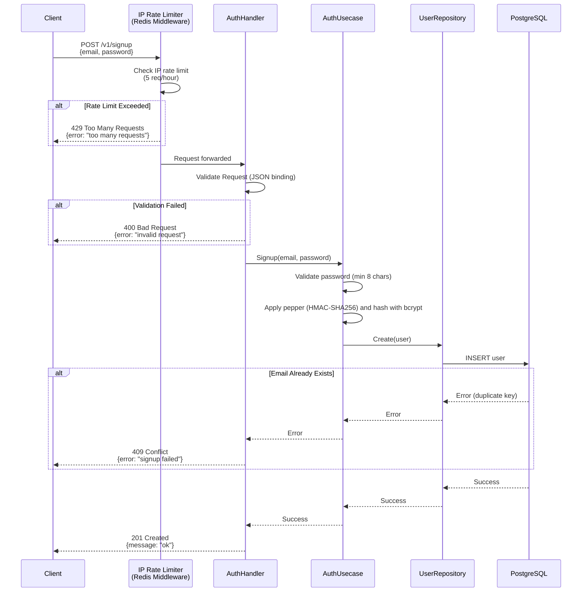
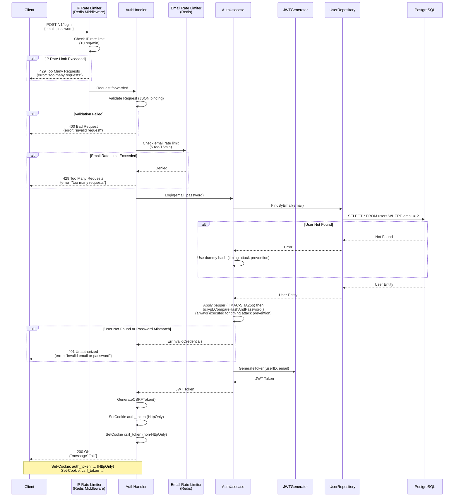
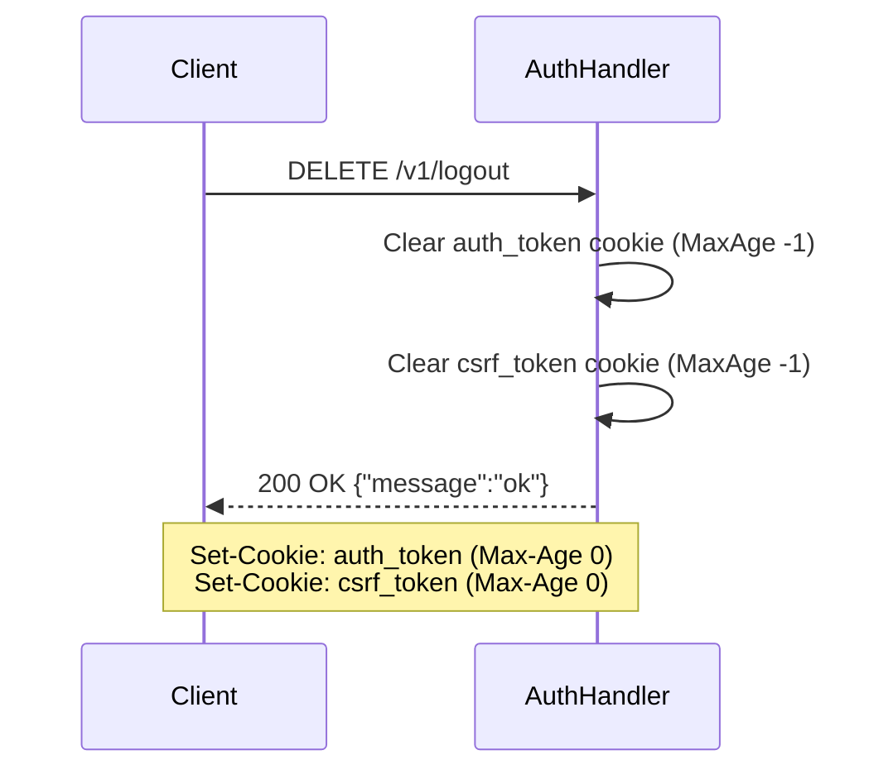
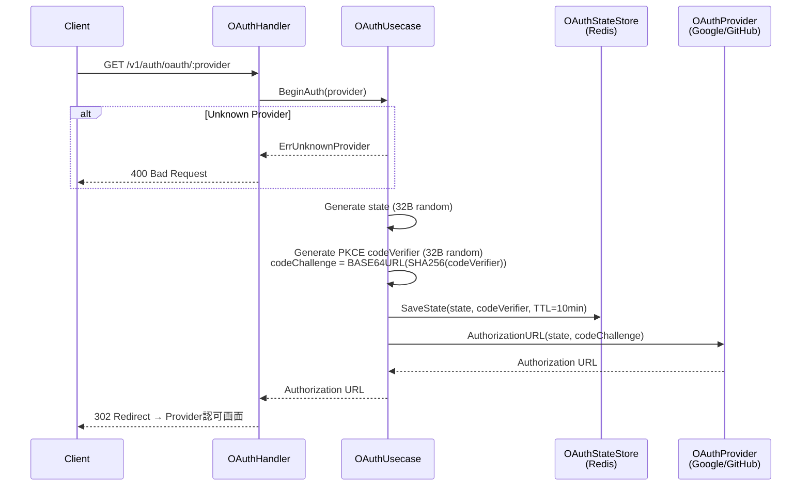
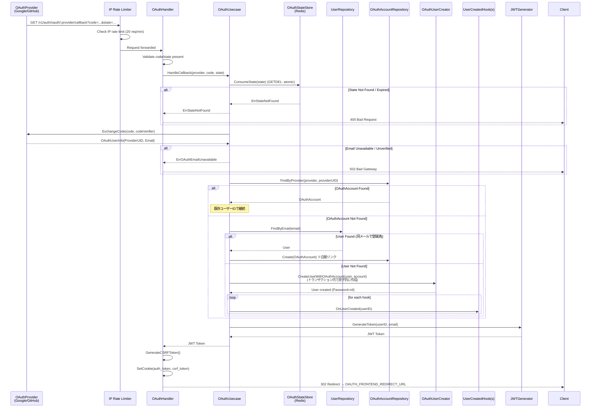
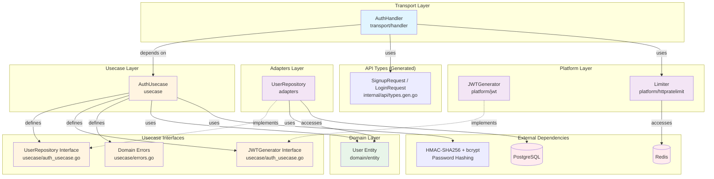

# Auth フィーチャー

## 概要

Auth フィーチャーは、JWT（JSON Web Token）ベースの認証システムを提供します。ユーザー登録、ログイン、JWTトークンの発行・検証を処理します。

### 主な機能

- **ユーザー登録（Signup）**: メールアドレスとパスワードで新規ユーザーを登録
- **ログイン**: 認証情報を検証し、JWTトークンを発行
- **OAuth2 ログイン**: Google / GitHub プロバイダーによるソーシャルログイン（PKCE 対応・既存ユーザーへの自動リンク）
- **パスワード暗号化**: HMAC-SHA256ペッパー + bcryptによる安全なパスワードハッシュ化
- **JWT認証**: 保護エンドポイントへのアクセス制御用に有効期限1時間のJWTトークンを発行
- **レートリミット**: Redis Sorted Setによるスライディングウィンドウ方式でブルートフォース攻撃を防止

## シーケンス図

### ユーザー登録フロー


```mermaid
sequenceDiagram
    participant Client
    participant RateLimit as IP Rate Limiter<br/>(Redis Middleware)
    participant Handler as AuthHandler
    participant Usecase as AuthUsecase
    participant Repository as UserRepository
    participant DB as PostgreSQL

    Client->>RateLimit: POST /v1/signup<br/>{email, password}
    RateLimit->>RateLimit: Check IP rate limit<br/>(5 req/hour)

    alt Rate Limit Exceeded
        RateLimit-->>Client: 429 Too Many Requests<br/>{error: "too many requests"}
    end

    RateLimit->>Handler: Request forwarded
    Handler->>Handler: Validate Request (JSON binding)

    alt Validation Failed
        Handler-->>Client: 400 Bad Request<br/>{error: "invalid request"}
    end

    Handler->>Usecase: Signup(email, password)
    Usecase->>Usecase: Validate password (min 8 chars)
    Usecase->>Usecase: Apply pepper (HMAC-SHA256) and hash with bcrypt
    Usecase->>Repository: Create(user)
    Repository->>DB: INSERT user

    alt Email Already Exists
        DB-->>Repository: Error (duplicate key)
        Repository-->>Usecase: Error
        Usecase-->>Handler: Error
        Handler-->>Client: 409 Conflict<br/>{error: "signup failed"}
    end

    DB-->>Repository: Success
    Repository-->>Usecase: Success
    Usecase-->>Handler: Success
    Handler-->>Client: 201 Created<br/>{message: "ok"}
```

### ログインフロー


```mermaid
sequenceDiagram
    participant Client
    participant RateLimit as IP Rate Limiter<br/>(Redis Middleware)
    participant Handler as AuthHandler
    participant Limiter as Email Rate Limiter<br/>(Redis)
    participant Usecase as AuthUsecase
    participant JWTGenerator as JWTGenerator
    participant Repository as UserRepository
    participant DB as PostgreSQL

    Client->>RateLimit: POST /v1/login<br/>{email, password}
    RateLimit->>RateLimit: Check IP rate limit<br/>(10 req/min)

    alt IP Rate Limit Exceeded
        RateLimit-->>Client: 429 Too Many Requests<br/>{error: "too many requests"}
    end

    RateLimit->>Handler: Request forwarded
    Handler->>Handler: Validate Request (JSON binding)

    alt Validation Failed
        Handler-->>Client: 400 Bad Request<br/>{error: "invalid request"}
    end

    Handler->>Limiter: Check email rate limit<br/>(5 req/15min)

    alt Email Rate Limit Exceeded
        Limiter-->>Handler: Denied
        Handler-->>Client: 429 Too Many Requests<br/>{error: "too many requests"}
    end

    Handler->>Usecase: Login(email, password)
    Usecase->>Repository: FindByEmail(email)
    Repository->>DB: SELECT * FROM users WHERE email = ?

    alt User Not Found
        DB-->>Repository: Not Found
        Repository-->>Usecase: Error
        Usecase->>Usecase: Use dummy hash (timing attack prevention)
    end

    DB-->>Repository: User Entity
    Repository-->>Usecase: User Entity
    Usecase->>Usecase: Apply pepper (HMAC-SHA256) then<br/>bcrypt.CompareHashAndPassword()<br/>(always executed for timing attack prevention)

    alt User Not Found or Password Mismatch
        Usecase-->>Handler: ErrInvalidCredentials
        Handler-->>Client: 401 Unauthorized<br/>{error: "invalid email or password"}
    end

    Usecase->>JWTGenerator: GenerateToken(userID, email)
    JWTGenerator-->>Usecase: JWT Token
    Usecase-->>Handler: JWT Token
    Handler->>Handler: GenerateCSRFToken()
    Handler->>Handler: SetCookie auth_token (HttpOnly)
    Handler->>Handler: SetCookie csrf_token (non-HttpOnly)
    Handler-->>Client: 200 OK<br/>{"message":"ok"}
    Note over Handler,Client: Set-Cookie: auth_token=... (HttpOnly)<br/>Set-Cookie: csrf_token=...
```

### ログアウトフロー


```mermaid
sequenceDiagram
    participant Client
    participant Handler as AuthHandler

    Client->>Handler: DELETE /v1/logout
    Handler->>Handler: Clear auth_token cookie (MaxAge -1)
    Handler->>Handler: Clear csrf_token cookie (MaxAge -1)
    Handler-->>Client: 200 OK {"message":"ok"}
    Note over Handler,Client: Set-Cookie: auth_token (Max-Age 0)<br/>Set-Cookie: csrf_token (Max-Age 0)
```

**注意**: ログアウトは期限切れトークンでも動作するよう、認証不要のルートに配置されています。

### OAuth2 認可開始フロー


```mermaid
sequenceDiagram
    participant Client
    participant Handler as OAuthHandler
    participant Usecase as OAuthUsecase
    participant StateStore as OAuthStateStore<br/>(Redis)
    participant Provider as OAuthProvider<br/>(Google/GitHub)

    Client->>Handler: GET /v1/auth/oauth/:provider
    Handler->>Usecase: BeginAuth(provider)

    alt Unknown Provider
        Usecase-->>Handler: ErrUnknownProvider
        Handler-->>Client: 400 Bad Request
    end

    Usecase->>Usecase: Generate state (32B random)
    Usecase->>Usecase: Generate PKCE codeVerifier (32B random)<br/>codeChallenge = BASE64URL(SHA256(codeVerifier))
    Usecase->>StateStore: SaveState(state, codeVerifier, TTL=10min)
    Usecase->>Provider: AuthorizationURL(state, codeChallenge)
    Provider-->>Usecase: Authorization URL
    Usecase-->>Handler: Authorization URL
    Handler-->>Client: 302 Redirect → Provider認可画面
```

### OAuth2 コールバックフロー


```mermaid
sequenceDiagram
    participant Provider as OAuthProvider<br/>(Google/GitHub)
    participant RateLimit as IP Rate Limiter
    participant Handler as OAuthHandler
    participant Usecase as OAuthUsecase
    participant StateStore as OAuthStateStore<br/>(Redis)
    participant UserRepo as UserRepository
    participant OAuthRepo as OAuthAccountRepository
    participant Creator as OAuthUserCreator
    participant Hooks as UserCreatedHook(s)
    participant JWT as JWTGenerator

    Provider->>RateLimit: GET /v1/auth/oauth/:provider/callback?code=...&state=...
    RateLimit->>RateLimit: Check IP rate limit (20 req/min)
    RateLimit->>Handler: Request forwarded
    Handler->>Handler: Validate code/state present
    Handler->>Usecase: HandleCallback(provider, code, state)
    Usecase->>StateStore: ConsumeState(state) (GETDEL: atomic)

    alt State Not Found / Expired
        StateStore-->>Usecase: ErrStateNotFound
        Usecase-->>Handler: ErrStateNotFound
        Handler-->>Client: 400 Bad Request
    end

    Usecase->>Provider: ExchangeCode(code, codeVerifier)
    Provider-->>Usecase: OAuthUserInfo{ProviderUID, Email}

    alt Email Unavailable / Unverified
        Usecase-->>Handler: ErrOAuthEmailUnavailable
        Handler-->>Client: 502 Bad Gateway
    end

    Usecase->>OAuthRepo: FindByProvider(provider, providerUID)

    alt OAuthAccount Found
        OAuthRepo-->>Usecase: OAuthAccount
        Note over Usecase: 既存ユーザーIDで継続
    else OAuthAccount Not Found
        Usecase->>UserRepo: FindByEmail(email)
        alt User Found (同メールで登録済)
            UserRepo-->>Usecase: User
            Usecase->>OAuthRepo: Create(OAuthAccount) ※自動リンク
        else User Not Found
            Usecase->>Creator: CreateUserWithOAuthAccount(user, account)<br/>(トランザクション内で原子的に作成)
            Creator-->>Usecase: User created (Password=nil)
            loop for each hook
                Usecase->>Hooks: OnUserCreated(userID)
            end
        end
    end

    Usecase->>JWT: GenerateToken(userID, email)
    JWT-->>Usecase: JWT Token
    Usecase-->>Handler: JWT Token
    Handler->>Handler: GenerateCSRFToken()
    Handler->>Handler: SetCookie(auth_token, csrf_token)
    Handler-->>Client: 302 Redirect → OAUTH_FRONTEND_REDIRECT_URL
```

## API仕様

### POST /v1/signup

新規ユーザーを登録します。

**リクエスト**
```json
{
  "email": "user@example.com",
  "password": "password123"
}
```

**バリデーションルール**
- `email`: 必須、有効なメールアドレス形式
- `password`: 必須、最低8文字

**レスポンス**

- **201 Created** - 登録成功
  ```json
  {
    "message": "ok"
  }
  ```

- **400 Bad Request** - バリデーションエラー
  ```json
  {
    "error": "invalid request"
  }
  ```

- **409 Conflict** - ユーザー作成失敗（メールアドレスが既に使用されている等）
  ```json
  {
    "error": "signup failed"
  }
  ```

- **429 Too Many Requests** - レートリミット超過（IPベース: 5回/時間）
  ```json
  {
    "error": "too many requests"
  }
  ```
  ヘッダー: `Retry-After: <秒数>`

### POST /v1/login

ユーザーを認証し、JWTトークンを発行します。

**リクエスト**
```json
{
  "email": "user@example.com",
  "password": "password123"
}
```

**バリデーションルール**
- `email`: 必須、有効なメールアドレス形式
- `password`: 必須

**レスポンス**

- **200 OK** - 認証成功
  ```json
  {
    "message": "ok"
  }
  ```

  **Set-Cookieヘッダー:**
  - `auth_token`: JWTトークン（`HttpOnly; SameSite=Lax; Max-Age=3600`）— JavaScriptから読み取り不可（XSS対策）
  - `csrf_token`: CSRFトークン（`SameSite=Lax; Max-Age=3600`）— JavaScriptが読み取り `X-CSRF-Token` ヘッダーにセット（CSRF対策）

  **JWTクレーム（auth_token内）:**
  - `sub`: ユーザーID（int64を文字列として格納）
  - `email`: ユーザーのメールアドレス
  - `iat`: 発行日時（Unixタイムスタンプ）
  - `exp`: 有効期限（発行日時 + 1時間）

- **400 Bad Request** - バリデーションエラー
  ```json
  {
    "error": "invalid request"
  }
  ```

- **401 Unauthorized** - 認証失敗（メールアドレスまたはパスワードが無効）
  ```json
  {
    "error": "invalid email or password"
  }
  ```

- **429 Too Many Requests** - レートリミット超過（IPベース: 10回/分、メールベース: 5回/15分）
  ```json
  {
    "error": "too many requests"
  }
  ```
  ヘッダー: `Retry-After: <秒数>`

### DELETE /v1/logout

ログアウトします（`auth_token` と `csrf_token` のCookieを削除）。認証不要です。

**レスポンス**

- **200 OK** - ログアウト成功
  ```json
  {
    "message": "ok"
  }
  ```

  **Set-Cookieヘッダー:**
  - `auth_token`: 空文字列、`Max-Age=0`（即時削除）
  - `csrf_token`: 空文字列、`Max-Age=0`（即時削除）

**注意**: 期限切れトークンを持つクライアントでも必ずログアウトできるよう、認証不要のエンドポイントに設定されています。

### GET /v1/auth/oauth/:provider

OAuth2 認可フローを開始し、プロバイダーの認可画面へリダイレクトします。OAuth 環境変数（`GOOGLE_CLIENT_ID` または `GITHUB_CLIENT_ID`）が設定されている場合のみルートが登録されます。

**パスパラメータ**
- `provider`: `google` | `github`

**レスポンス**

- **302 Found** - プロバイダーの認可URLへリダイレクト
- **400 Bad Request** - 未対応のプロバイダー
  ```json
  { "error": "unsupported provider" }
  ```

### GET /v1/auth/oauth/:provider/callback

プロバイダーから認可コードを受け取り、ユーザー認証・JWT 発行・フロントエンドへのリダイレクトを行います。

**パスパラメータ**
- `provider`: `google` | `github`

**クエリパラメータ**
- `code`: 認可コード（必須）
- `state`: CSRF 保護用 state トークン（必須）

**レスポンス**

- **302 Found** - 成功（`OAUTH_FRONTEND_REDIRECT_URL` へリダイレクト）
  - `Set-Cookie: auth_token=<JWT>; HttpOnly; SameSite=Lax; Max-Age=3600`
  - `Set-Cookie: csrf_token=<token>; SameSite=Lax; Max-Age=3600`
- **400 Bad Request** - state が不正・期限切れ、または code/state 欠落、未対応のプロバイダー
  ```json
  { "error": "invalid or expired state" }
  ```
- **502 Bad Gateway** - プロバイダーから検証済みメールアドレスが取得できない
  ```json
  { "error": "cannot obtain verified email from provider" }
  ```
- **429 Too Many Requests** - レートリミット超過（IPベース: 20回/分）
- **500 Internal Server Error** - その他のエラー

## レートリミット

認証エンドポイントにはRedisベースのスライディングウィンドウレートリミットが適用されています。

| エンドポイント | 制限キー | 制限値 | ウィンドウ | 適用箇所 |
|---|---|---|---|---|
| `POST /v1/login` | IPアドレス | 10回 | 1分 | Ginミドルウェア |
| `POST /v1/login` | メールアドレス | 5回 | 15分 | AuthHandler内 |
| `POST /v1/signup` | IPアドレス | 5回 | 1時間 | Ginミドルウェア |
| `GET /v1/auth/oauth/:provider/callback` | IPアドレス | 20回 | 1分 | Ginミドルウェア |

### アルゴリズム

Redis Sorted Setを使用したSliding Window Logアルゴリズム:

1. `ZREMRANGEBYSCORE` でウィンドウ外の古いエントリを削除
2. `ZCARD` で現在のウィンドウ内のリクエスト数を取得
3. `ZADD` で現在のリクエストを追加（ナノ秒タイムスタンプをスコアとして使用）
4. `EXPIRE` でキーの有効期限を設定（安全ネット）

### グレースフルデグレード

Redisが利用できない場合、レートリミットは無効化され、すべてのリクエストが許可されます（既存のキャッシュデコレータと同じパターン）。

## 依存関係図


```mermaid
graph TB
    subgraph "Transport Layer"
        Handler[AuthHandler<br/>transport/handler]
    end

    subgraph "API Types (Generated)"
        APITypes[SignupRequest / LoginRequest<br/>internal/api/types.gen.go]
    end

    subgraph "Usecase Layer"
        Usecase[AuthUsecase<br/>usecase]
    end

    subgraph "Domain Layer"
        Entity[User Entity<br/>domain/entity]
    end

    subgraph "Usecase Interfaces"
        RepoInterface[UserRepository Interface<br/>usecase/auth_usecase.go]
        JWTInterface[JWTGenerator Interface<br/>usecase/auth_usecase.go]
        Errors[Domain Errors<br/>usecase/errors.go]
    end

    subgraph "Adapters Layer"
        RepoImpl[UserRepository<br/>adapters]
    end

    subgraph "Platform Layer"
        JWTImpl[JWTGenerator<br/>platform/jwt]
        RateLimiter[Limiter<br/>platform/httpratelimit]
    end

    subgraph "External Dependencies"
        DB[(PostgreSQL)]
        BCrypt[HMAC-SHA256 + bcrypt<br/>Password Hashing]
        Redis[(Redis)]
    end

    Handler -->|depends on| Usecase
    Handler -->|uses| APITypes
    Handler -->|uses| RateLimiter
    Usecase -->|defines| RepoInterface
    Usecase -->|defines| JWTInterface
    Usecase -->|defines| Errors
    Usecase -->|uses| Entity
    Usecase -->|uses| BCrypt
    RepoImpl -.->|implements| RepoInterface
    RepoImpl -->|uses| Entity
    RepoImpl -->|accesses| DB
    JWTImpl -.->|implements| JWTInterface
    RateLimiter -->|accesses| Redis

    style Handler fill:#e1f5ff
    style Usecase fill:#fff4e1
    style Entity fill:#e8f5e9
    style RepoInterface fill:#fff4e1
    style JWTInterface fill:#fff4e1
    style Errors fill:#fff4e1
    style RepoImpl fill:#f3e5f5
    style JWTImpl fill:#f3e5f5
    style RateLimiter fill:#f3e5f5
    style DB fill:#ffebee
    style Redis fill:#ffebee
```

### 依存関係の説明

#### Transport層
- **AuthHandler**（[transport/handler/auth_handler.go](transport/handler/auth_handler.go)）: メール/パスワード認証のHTTPリクエストを処理し、AuthUsecaseを呼び出す
- **OAuthHandler**（[transport/handler/oauth_handler.go](transport/handler/oauth_handler.go)）: OAuth2 認可開始およびコールバックを処理し、OAuthUsecaseを呼び出す
  - `OAuthUsecase` インターフェースを定義（コンシューマー側で定義）
- **API型**（`internal/api/types.gen.go`）: OpenAPI仕様から自動生成されたリクエスト/レスポンス型を使用
  - `api.SignupRequest`: ユーザー登録リクエスト
  - `api.LoginRequest`: ログインリクエスト

#### Usecase層
- **AuthUsecase**（[usecase/auth_usecase.go](usecase/auth_usecase.go)）: 認証ビジネスロジックを実装
  - パスワードバリデーション（最低8文字）
  - パスワードハッシュ化（bcrypt + HMAC-SHA256 ペッパー）
  - タイミング攻撃を防止するパスワード検証（ユーザー未検出時もbcrypt比較を実行）
  - UserRepository / JWTGenerator / UserCreatedHook インターフェースを定義
- **OAuthUsecase**（[usecase/oauth_usecase.go](usecase/oauth_usecase.go)）: OAuth2 認証フローを実装
  - PKCE（S256）の state / codeVerifier 生成
  - 既存ユーザー（同メール）への自動リンク
  - 新規ユーザー作成は `OAuthUserCreator` でトランザクション原子化
  - `UserCreatedHook` を呼び出して付随処理（例: ウォッチリスト初期化）を実行
  - `OAuthProvider` / `OAuthStateStore` / `OAuthAccountRepository` / `OAuthUserCreator` インターフェースを定義
- **ドメインエラー**（[usecase/errors.go](usecase/errors.go)）: エラー定義の一元管理
  - `ErrUserNotFound`: ユーザー検索が失敗した場合に返却
  - `ErrEmailAlreadyExists`: メールアドレスが既に登録されている場合に返却
  - `ErrInvalidCredentials`: メールアドレスまたはパスワードが正しくない場合に返却
  - `ErrStateNotFound`: OAuth state が存在しない・期限切れ
  - `ErrOAuthEmailUnavailable`: OAuth プロバイダーから検証済みメールが取得できない
  - `ErrUnknownProvider`: 未対応の OAuth プロバイダー指定

#### Domain層
- **User Entity**（[domain/entity/user.go](domain/entity/user.go)）: ユーザードメインモデル（OAuth 専用ユーザーは `Password = nil`）
- **OAuthAccount Entity**（[domain/entity/oauth_account.go](domain/entity/oauth_account.go)）: OAuth プロバイダーとユーザーの紐付け
  - `(provider, provider_uid)` の複合ユニーク制約
  - `oauth_accounts` テーブルにマッピング

#### Usecase層インターフェース（続き）
- **UserRepository**: ユーザー永続化（`Create`, `FindByEmail`, `FindByID`）
- **JWTGenerator**: 署名済みJWTトークン生成（`GenerateToken(userID, email)`）
- **OAuthProvider**: プロバイダー抽象化（`AuthorizationURL`, `ExchangeCode`）
- **OAuthStateStore**: PKCE state の一時保存（`SaveState`, `ConsumeState`）
- **OAuthAccountRepository**: `oauth_accounts` 永続化（`FindByProvider`, `Create`）
- **OAuthUserCreator**: User と OAuthAccount をトランザクション内で原子的に作成
- **UserCreatedHook**: ユーザー新規作成後のフック（例: ウォッチリスト初期化）

#### Adapters層
- **userRepository**（[adapters/user_repository.go](adapters/user_repository.go)）: UserRepository / OAuthUserCreator の sqlc + database/sql 実装
- **oauthAccountRepository**（[adapters/oauth_account_repository.go](adapters/oauth_account_repository.go)）: OAuthAccountRepository の sqlc + database/sql 実装
- **redisOAuthStateStore**（[adapters/oauth_state_store.go](adapters/oauth_state_store.go)）: OAuthStateStore の Redis 実装（`GETDEL` で atomic に消費）
- **GoogleProvider**（[adapters/google_provider.go](adapters/google_provider.go)）: Google OAuth2 実装（PKCE S256 対応、`/oauth2/v3/userinfo` でメール取得）
- **GitHubProvider**（[adapters/github_provider.go](adapters/github_provider.go)）: GitHub OAuth2 実装（GitHub は PKCE 非対応、state による CSRF 保護のみ）
- **マイグレーション**（[adapters/migration.go](adapters/migration.go)）: `users.password` の NULL 許容化、`oauth_accounts` の FK 制約追加（冪等）

### アーキテクチャ上の特徴

1. **クリーンアーキテクチャ**: ドメイン層はインフラストラクチャ層から独立
2. **依存性逆転**: Usecaseは具体的な実装ではなく、UserRepositoryインターフェースとJWTGeneratorインターフェースを定義・依存（Goの「インターフェースは利用者が定義する」原則に従う）
3. **インターフェースの所有権**: リポジトリインターフェースとJWT生成インターフェースは、使用されるusecase層で定義（Goのベストプラクティス）
4. **Cookie + CSRF 二重保護**:
   - `auth_token`: httpOnly Cookie（XSS攻撃からトークンを保護）
   - `csrf_token`: 非httpOnly Cookie（JavaScriptが `X-CSRF-Token` ヘッダーにセット）
   - 両トークンの一致を検証（Double Submit Cookieパターン）
5. **セキュリティ**:
   - パスワードは保存前にbcryptでハッシュ化
   - タイミング攻撃の防止（ユーザー未検出時もbcrypt比較を実行）
   - JWTトークンはHS256アルゴリズムで署名（`platform/jwt` で実装）
   - 署名には環境変数 `JWT_SECRET` を使用
   - ハンドラーレベルで汎用エラーメッセージを返却し、列挙攻撃を防止

## ディレクトリ構成

```
auth/
├── README.md                          # このファイル
├── domain/
│   └── entity/
│       ├── user.go                   # Userエンティティ定義
│       └── oauth_account.go          # OAuthAccountエンティティ定義
├── usecase/
│   ├── auth_usecase.go               # 認証ビジネスロジック + UserRepository等インターフェース
│   ├── auth_usecase_test.go          # Usecaseテスト
│   ├── oauth_usecase.go              # OAuth2ビジネスロジック + OAuth関連インターフェース
│   └── errors.go                     # ドメインエラー定義
├── adapters/
│   ├── sqlc/                         # sqlc 生成コード（編集禁止）
│   │   ├── queries.sql               # クエリ定義
│   │   └── *.go                      # 型安全な生成コード
│   ├── user_repository.go            # UserRepository/OAuthUserCreator 実装
│   ├── user_repository_test.go       # リポジトリテスト
│   ├── oauth_account_repository.go   # OAuthAccountRepository 実装
│   ├── oauth_state_store.go          # OAuthStateStoreのRedis実装
│   ├── google_provider.go            # Google OAuth2プロバイダー実装
│   └── github_provider.go            # GitHub OAuth2プロバイダー実装
└── transport/
    └── handler/
        ├── auth_handler.go           # 認証HTTPハンドラー（signup/login/logout）
        ├── auth_handler_test.go      # ハンドラーテスト
        └── oauth_handler.go          # OAuth2 HTTPハンドラー（begin/callback）
```

## テスト

auth フィーチャーのすべてのテストは、一貫性と保守性のために**テーブル駆動テストパターン**に従っています。

### テスト構造とパターン

#### 全テスト共通のパターン

1. **テーブル駆動テスト**: すべてのテスト関数は `tests` スライスと構造体フィールドを使用:
   - `name`: テストケースの説明（例: `"success: user creation"`, `"failure: duplicate email"`）
   - `wantErr`: エラーが期待されるかどうかを示すブールフラグ
   - テストタイプ固有の追加フィールド（後述）

2. **並列実行**: すべてのテストは `t.Parallel()` を使用して並行実行を有効化:
   ```go
   func TestSomething(t *testing.T) {
       t.Parallel()  // 並列実行を有効化

       tests := []struct { /* ... */ }{/* ... */}

       for _, tt := range tests {
           t.Run(tt.name, func(t *testing.T) {
               t.Parallel()  // サブテストの並列実行を有効化
               // テストロジック...
           })
       }
   }
   ```

3. **ヘルパー関数**: 各テストファイルにはコード重複を削減するヘルパー関数を含む:
   - Usecase: `createTestUser()`, `assertError()`, `verifyBcryptHash()`
   - Handler: `makeRequest()`, `assertJSONResponse()`
   - Repository: `setupTestDB()`, `seedUser()`

#### Usecaseテスト（[usecase/auth_usecase_test.go](usecase/auth_usecase_test.go)）

**モックリポジトリ**を使用してビジネスロジックを単独でテストします。

**テストケース構造:**
```go
tests := []struct {
    name              string
    email             string
    password          string
    wantErr           bool
    errMsg            string           // 期待されるエラーメッセージ
    verifyBcryptHash  bool             // パスワードハッシュ化を検証するか
    repositoryErr     error            // モックリポジトリのエラー
}{/* ... */}
```

**主な特徴:**
- 関数フィールドによるカスタマイズ可能な動作を持つモック実装
- bcryptパスワード検証
- JWTトークン生成の検証

**実行コマンド:**
```bash
go test ./internal/feature/auth/usecase/... -v
```

#### ハンドラーテスト（[transport/handler/auth_handler_test.go](transport/handler/auth_handler_test.go)）

**モックusecase**を使用してHTTPリクエスト/レスポンスの処理をテストします。

**テストケース構造:**
```go
tests := []struct {
    name           string
    requestBody    gin.H
    mockSignupFunc func(ctx context.Context, email, password string) error
    expectedStatus int
    expectedBody   gin.H
}{/* ... */}
```

**主な特徴:**
- HTTPリクエスト/レスポンスの検証
- DTOバリデーションのテスト
- ステータスコードの検証
- JSONレスポンスボディのマッチング

**実行コマンド:**
```bash
go test ./internal/feature/auth/transport/handler/... -v
```

#### リポジトリテスト（[adapters/user_repository_test.go](adapters/user_repository_test.go)）

統合テストに**インメモリSQLiteデータベース**を使用します。

**テストケース構造:**
```go
tests := []struct {
    name         string
    email        string          // （テストによってはuser, userIDなど）
    wantErr      bool
    expectedErr  error           // 特定のエラー型（例: usecase.ErrUserNotFound）
    setupFunc    func(t *testing.T, db *sql.DB) *entity.User  // テストデータの準備
    validateFunc func(t *testing.T, expected, found *entity.User)  // 結果の検証
}{/* ... */}
```

**主な特徴:**
- 各テストが testcontainers-go (`dbtest.OpenIsolatedDB`) で独立した PostgreSQL DB を取得
- `setupFunc`: 実行前にテストデータを準備
- `validateFunc`: 成功ケースのカスタム検証ロジック
- データベース制約のテスト（ユニークメール、タイムスタンプなど）

**実行コマンド:**
```bash
go test ./internal/feature/auth/adapters/... -v
```

### 全テスト実行

```bash
go test ./internal/feature/auth/... -v -race -cover
```

### テスト出力例

```
=== RUN   TestAuthUsecase_Signup
=== PAUSE TestAuthUsecase_Signup
=== CONT  TestAuthUsecase_Signup
=== RUN   TestAuthUsecase_Signup/success:_user_creation
=== PAUSE TestAuthUsecase_Signup/success:_user_creation
=== RUN   TestAuthUsecase_Signup/failure:_password_too_short
=== PAUSE TestAuthUsecase_Signup/failure:_password_too_short
...
--- PASS: TestAuthUsecase_Signup (0.01s)
    --- PASS: TestAuthUsecase_Signup/success:_user_creation (0.00s)
    --- PASS: TestAuthUsecase_Signup/failure:_password_too_short (0.00s)
```

## 環境変数

| 変数名 | 説明 | 必須 |
|--------|------|------|
| `JWT_SECRET` | JWTトークン署名用の秘密鍵 | ✅ |
| `PASSWORD_PEPPER` | パスワードハッシュ用ペッパー（HMAC-SHA256のキー） | ✅ |
| `OAUTH_FRONTEND_REDIRECT_URL` | OAuth 認証完了後のリダイレクト先 URL | OAuth有効時 |
| `GOOGLE_CLIENT_ID` | Google OAuth クライアント ID | Google有効時 |
| `GOOGLE_CLIENT_SECRET` | Google OAuth クライアントシークレット | Google有効時 |
| `GOOGLE_REDIRECT_URL` | Google OAuth コールバック URL（例: `https://api.example.com/v1/auth/oauth/google/callback`） | Google有効時 |
| `GITHUB_CLIENT_ID` | GitHub OAuth クライアント ID | GitHub有効時 |
| `GITHUB_CLIENT_SECRET` | GitHub OAuth クライアントシークレット | GitHub有効時 |
| `GITHUB_REDIRECT_URL` | GitHub OAuth コールバック URL | GitHub有効時 |

`GOOGLE_CLIENT_ID` または `GITHUB_CLIENT_ID` のいずれかが設定されている場合、OAuth 機能が有効化されます。OAuth 有効時は Redis 接続が必須です（state 保存に使用）。

**設定例**（`docker/.env.app`）:
```
JWT_SECRET=your-super-secret-key-change-this-in-production
PASSWORD_PEPPER=your-password-pepper-change-this-in-production
OAUTH_FRONTEND_REDIRECT_URL=https://app.example.com/auth/callback
GOOGLE_CLIENT_ID=your-google-client-id
GOOGLE_CLIENT_SECRET=your-google-client-secret
GOOGLE_REDIRECT_URL=https://api.example.com/v1/auth/oauth/google/callback
```

## セキュリティに関する注意事項

1. **パスワードハッシュ化**: HMAC-SHA256ペッパー + bcryptを使用（デフォルトコスト: 10）。ペッパーは環境変数 `PASSWORD_PEPPER` で管理し、DBが漏洩した場合の追加防御層として機能。bcryptの72バイト入力制限を回避するため、HMAC-SHA256で固定長出力に変換後にbcryptでハッシュ化
2. **タイミング攻撃防止**: ユーザーが存在しない場合でもダミーハッシュを使用してbcrypt比較を実行し、レスポンス時間の差異による情報漏洩を防止
3. **Cookie + CSRF 二重保護**:
   - `auth_token`（httpOnly）: JavaScriptから読み取り不可のためXSS攻撃でトークン窃取不可
   - `csrf_token`（非httpOnly）: JavaScriptが読み取り `X-CSRF-Token` ヘッダーにセット → CSRF攻撃を防止
   - `SameSite=Lax` 設定でクロスサイトリクエストを制限
4. **JWTの有効期限**: 1時間で自動的に失効
5. **認証方式フォールバック**: `auth_token` Cookieを優先、存在しない場合は `Authorization: Bearer <token>` ヘッダーにフォールバック（API/curlクライアント対応）
6. **エラーメッセージの統一化**:
   - バリデーションエラー: 汎用 "invalid request" メッセージを返却
   - ログイン失敗: 統一された "invalid email or password" メッセージを返却
   - サインアップ失敗: 汎用 "signup failed" メッセージを返却
   - 列挙攻撃を防止するため、詳細なエラー情報はサーバーログにのみ記録
7. **JWT_SECRET**: 環境変数で管理。本番環境では強力な秘密鍵を使用すること

## 今後の拡張

- リフレッシュトークンの実装
- パスワードリセット機能
- メール認証
- 二要素認証（2FA）
- 追加 OAuth プロバイダー対応（例: Apple, Microsoft）
