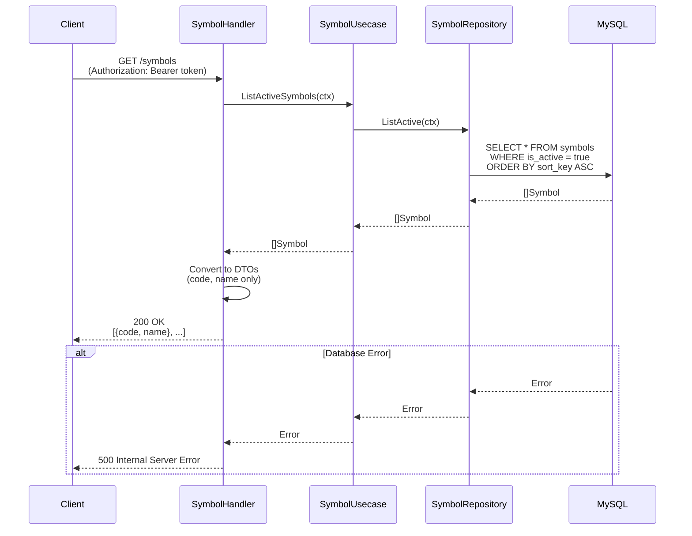
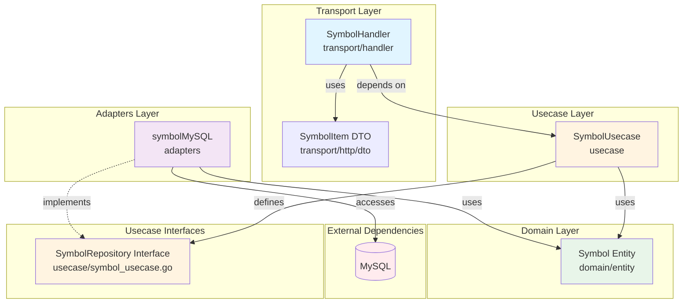

# Symbollist Feature

## Overview

The Symbollist feature provides stock ticker symbol management functionality. It handles retrieving the list of active trading symbols that users can track.

### Key Features

- **List Active Symbols**: Retrieve all active stock symbols available for tracking
- **Sorted Results**: Symbols are returned in a defined order based on `sort_key`
- **Active Filtering**: Only active symbols (`is_active = true`) are returned to clients

## Sequence Diagram

### List Symbols Flow



## API Specification

### GET /symbols

Retrieves the list of active stock symbols.

**Authentication**: Required (JWT Bearer token)

**Response**

- **200 OK** - Success
  ```json
  [
    {
      "code": "AAPL",
      "name": "Apple Inc."
    },
    {
      "code": "GOOGL",
      "name": "Alphabet Inc."
    },
    {
      "code": "MSFT",
      "name": "Microsoft Corporation"
    }
  ]
  ```

- **500 Internal Server Error** - Database error
  ```json
  {
    "error": "database connection failed"
  }
  ```

## Dependency Diagram



### Dependency Explanation

#### Transport Layer ([transport/handler/symbol_handler.go](transport/handler/symbol_handler.go))
- **SymbolHandler**: Processes HTTP requests and calls SymbolUsecase
- **SymbolItem DTO** ([transport/http/dto/symbol_list.go](transport/http/dto/symbol_list.go)): Response data structure containing only `code` and `name`

#### Usecase Layer ([usecase/symbol_usecase.go](usecase/symbol_usecase.go))
- **SymbolUsecase**: Implements business logic for symbol operations
  - Defines SymbolRepository interface (following Go's "consumer defines interface" convention)
- **SymbolRepository Interface**: Repository interface with:
  - `ListActive(ctx)`: Returns all active symbols
  - `ListActiveCodes(ctx)`: Returns only the codes of active symbols (used by batch ingest)

#### Domain Layer ([domain/entity/symbol.go](domain/entity/symbol.go))
- **Symbol Entity**: Stock symbol domain model with fields:
  - `ID`: Primary key
  - `Code`: Unique stock ticker code (e.g., "AAPL")
  - `Name`: Full company name
  - `Market`: Market identifier (e.g., "NASDAQ")
  - `IsActive`: Whether the symbol is active for tracking
  - `SortKey`: Display ordering priority
  - `UpdatedAt`: Last update timestamp

#### Adapters Layer ([adapters/symbol_mysql.go](adapters/symbol_mysql.go))
- **symbolMySQL**: MySQL implementation of SymbolRepository (using GORM)

### Architectural Characteristics

1. **Clean Architecture**: Domain layer is independent of infrastructure layer
2. **Dependency Inversion**: Usecase defines and depends on SymbolRepository interface, not concrete implementations
3. **Interface Ownership**: Repository interfaces are defined in the usecase layer where they are used (Go best practice)
4. **DTO Transformation**: Handler transforms domain entities to DTOs, exposing only necessary fields to clients

## Directory Structure

```
symbollist/
├── README.md                          # This file
├── domain/
│   └── entity/
│       └── symbol.go                 # Symbol entity definition
├── usecase/
│   ├── symbol_usecase.go             # Business logic + SymbolRepository interface
│   └── symbol_usecase_test.go        # Usecase tests
├── adapters/
│   ├── symbol_mysql.go               # MySQL repository implementation
│   └── symbol_mysql_test.go          # Repository tests
└── transport/
    ├── handler/
    │   ├── symbol_handler.go         # HTTP handlers
    │   └── symbol_handler_test.go    # Handler tests
    └── http/dto/
        └── symbol_list.go            # Response DTO
```

## Testing

All tests in the symbollist feature follow a **table-driven testing pattern** for consistency and maintainability.

### Test Structure and Patterns

#### Common Patterns Across All Tests

1. **Table-Driven Tests**: All test functions use a `tests` slice with struct fields:
   - `name`: Test case description (e.g., `"success: returns active symbols"`)
   - `wantErr`: Boolean flag indicating if an error is expected
   - Additional fields specific to each test type

2. **Parallel Execution**: All tests use `t.Parallel()` to enable concurrent execution

3. **Helper Functions**: Each test file includes helper functions to reduce code duplication

#### Usecase Tests ([usecase/symbol_usecase_test.go](usecase/symbol_usecase_test.go))

Uses **mock repositories** to test business logic in isolation.

**Run Command:**
```bash
go test ./internal/feature/symbollist/usecase/... -v
```

#### Handler Tests ([transport/handler/symbol_handler_test.go](transport/handler/symbol_handler_test.go))

Uses **mock usecases** to test HTTP request/response handling.

**Run Command:**
```bash
go test ./internal/feature/symbollist/transport/handler/... -v
```

#### Repository Tests ([adapters/symbol_mysql_test.go](adapters/symbol_mysql_test.go))

Uses **in-memory SQLite database** for integration testing.

**Run Command:**
```bash
go test ./internal/feature/symbollist/adapters/... -v
```

### Run All Tests

```bash
go test ./internal/feature/symbollist/... -v -race -cover
```

## Usage in Batch Ingest

The `ListActiveCodes` method is used by the batch ingest process (`cmd/ingest/main.go`) to determine which symbols to fetch market data for. This allows administrators to control which symbols are actively tracked by setting `is_active` in the database.

```go
// In batch ingest
codes, err := symbolRepo.ListActiveCodes(ctx)
for _, code := range codes {
    // Fetch market data for each active symbol
}
```

## Future Enhancements

- Symbol search functionality
- Symbol categories/sectors
- User-specific symbol watchlists
- Symbol metadata (description, industry, etc.)
- Admin endpoints for symbol management (CRUD operations)
