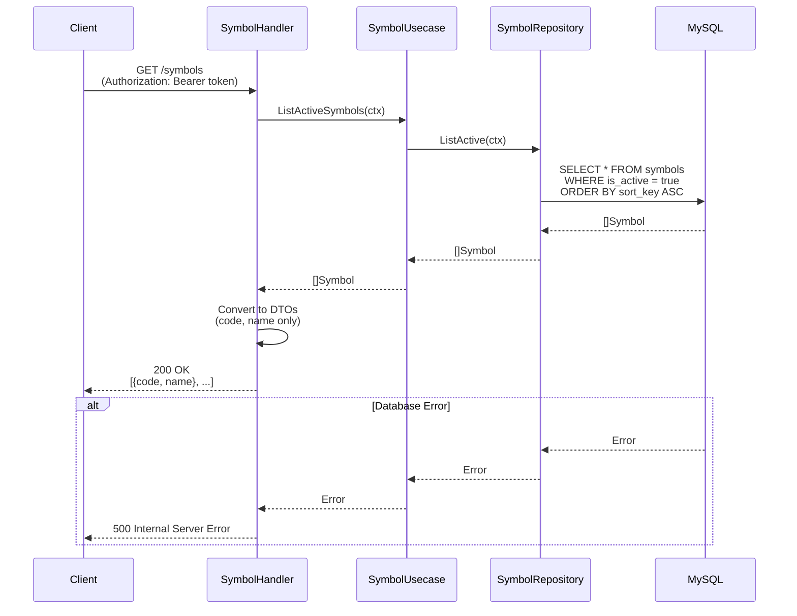
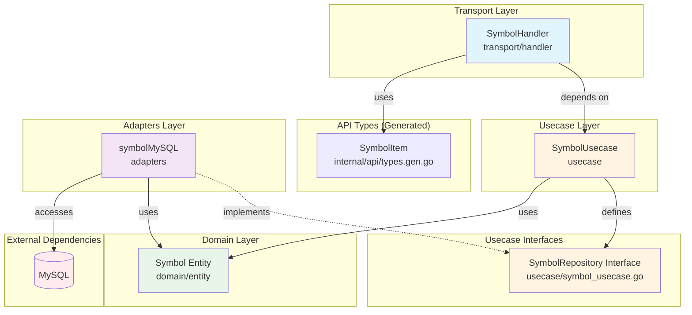

# Symbollistフィーチャー

## 概要

Symbollistフィーチャーは株式銘柄コードの管理機能を提供します。ユーザーがトラッキングできるアクティブな取引銘柄の一覧取得を処理します。

### 主な機能

- **アクティブ銘柄一覧**: トラッキング可能なすべてのアクティブな銘柄を取得
- **ソート済み結果**: 銘柄は `sort_key` に基づいた定義済みの順序で返却
- **アクティブフィルタリング**: アクティブな銘柄（`is_active = true`）のみがクライアントに返却

## シーケンス図

### 銘柄一覧取得フロー



## API仕様

### GET /symbols

アクティブな株式銘柄の一覧を取得します。

**認証**: 必須（JWT Bearerトークン）

**レスポンス**

- **200 OK** - 成功
  ```json
  [
    {
      "code": "AAPL",
      "name": "Apple Inc."
    },
    {
      "code": "GOOGL",
      "name": "Alphabet Inc."
    },
    {
      "code": "MSFT",
      "name": "Microsoft Corporation"
    }
  ]
  ```

- **500 Internal Server Error** - データベースエラー
  ```json
  {
    "error": "database connection failed"
  }
  ```

## 依存関係図



### 依存関係の説明

#### Transport層 ([transport/handler/symbol_handler.go](transport/handler/symbol_handler.go))
- **SymbolHandler**: HTTPリクエストを処理し、SymbolUsecaseを呼び出す
- **API型**（`internal/api/types.gen.go`）: OpenAPI仕様から自動生成された `api.SymbolItem` を使用

#### Usecase層 ([usecase/symbol_usecase.go](usecase/symbol_usecase.go))
- **SymbolUsecase**: 銘柄操作のビジネスロジックを実装
  - SymbolRepositoryインターフェースを定義（Goの「インターフェースは利用者が定義する」慣例に従う）
- **SymbolRepositoryインターフェース**: リポジトリインターフェース:
  - `ListActive(ctx)`: すべてのアクティブな銘柄を返す
  - `ListActiveCodes(ctx)`: アクティブな銘柄のコードのみを返す（バッチ取り込みで使用）

#### Domain層 ([domain/entity/symbol.go](domain/entity/symbol.go))
- **Symbolエンティティ**: 株式銘柄のドメインモデル。以下のフィールドを持つ:
  - `ID`: 主キー
  - `Code`: 一意の銘柄コード（例: "AAPL"）
  - `Name`: 企業名
  - `Market`: 市場識別子（例: "NASDAQ"）
  - `IsActive`: トラッキング対象かどうか
  - `SortKey`: 表示順序の優先度
  - `UpdatedAt`: 最終更新日時

#### Adapters層 ([adapters/symbol_mysql.go](adapters/symbol_mysql.go))
- **symbolMySQL**: SymbolRepositoryのMySQL実装（GORMを使用）

### アーキテクチャ特性

1. **クリーンアーキテクチャ**: ドメイン層はインフラストラクチャ層から独立
2. **依存性逆転**: Usecaseは具象実装ではなくSymbolRepositoryインターフェースを定義・依存
3. **インターフェースの所有権**: リポジトリインターフェースは使用されるusecase層で定義（Goのベストプラクティス）
4. **DTO変換**: Handlerがドメインエンティティをクライアントに必要なフィールドのみ公開するDTOに変換

## ディレクトリ構成

```
symbollist/
├── README.md                          # このファイル
├── domain/
│   └── entity/
│       └── symbol.go                 # Symbolエンティティ定義
├── usecase/
│   ├── symbol_usecase.go             # ビジネスロジック + SymbolRepositoryインターフェース
│   └── symbol_usecase_test.go        # Usecaseテスト
├── adapters/
│   ├── symbol_mysql.go               # MySQLリポジトリ実装
│   └── symbol_mysql_test.go          # リポジトリテスト
└── transport/
    └── handler/
        ├── symbol_handler.go         # HTTPハンドラー
        └── symbol_handler_test.go    # ハンドラーテスト
```

## テスト

symbollistフィーチャーのすべてのテストは、一貫性と保守性のために**テーブル駆動テストパターン**に従います。

### テスト構造とパターン

#### 全テスト共通のパターン

1. **テーブル駆動テスト**: すべてのテスト関数は構造体フィールドを持つ `tests` スライスを使用:
   - `name`: テストケースの説明（例: `"success: returns active symbols"`）
   - `wantErr`: エラーが期待されるかどうかのboolフラグ
   - 各テストタイプ固有の追加フィールド

2. **並列実行**: すべてのテストは `t.Parallel()` を使用して並行実行を有効化

3. **ヘルパー関数**: 各テストファイルにはコードの重複を削減するヘルパー関数を含む

#### Usecaseテスト ([usecase/symbol_usecase_test.go](usecase/symbol_usecase_test.go))

**モックリポジトリ**を使用してビジネスロジックを単体でテストします。

**実行コマンド:**
```bash
go test ./internal/feature/symbollist/usecase/... -v
```

#### Handlerテスト ([transport/handler/symbol_handler_test.go](transport/handler/symbol_handler_test.go))

**モックユースケース**を使用してHTTPリクエスト/レスポンス処理をテストします。

**実行コマンド:**
```bash
go test ./internal/feature/symbollist/transport/handler/... -v
```

#### リポジトリテスト ([adapters/symbol_mysql_test.go](adapters/symbol_mysql_test.go))

**インメモリSQLiteデータベース**を使用して結合テストを実施します。

**実行コマンド:**
```bash
go test ./internal/feature/symbollist/adapters/... -v
```

### 全テスト実行

```bash
go test ./internal/feature/symbollist/... -v -race -cover
```

## バッチ取り込みでの使用

`ListActiveCodes` メソッドはバッチ取り込みプロセス（`cmd/ingest/main.go`）で使用され、どの銘柄の市場データを取得するかを決定します。これにより、管理者はデータベースの `is_active` を設定することで、アクティブにトラッキングする銘柄を制御できます。

```go
// バッチ取り込み内
codes, err := symbolRepo.ListActiveCodes(ctx)
for _, code := range codes {
    // 各アクティブ銘柄の市場データを取得
}
```

## 今後の拡張予定

- 銘柄検索機能
- 銘柄カテゴリ/セクター
- ユーザー固有の銘柄ウォッチリスト
- 銘柄メタデータ（説明、業種など）
- 銘柄管理用の管理者エンドポイント（CRUD操作）
