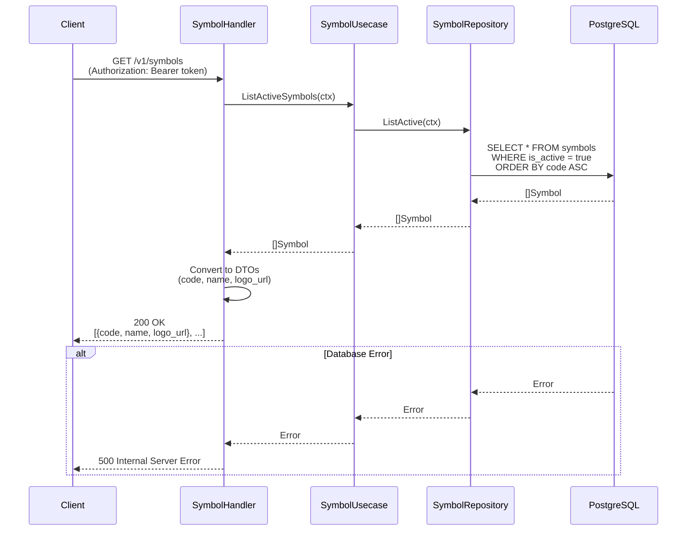
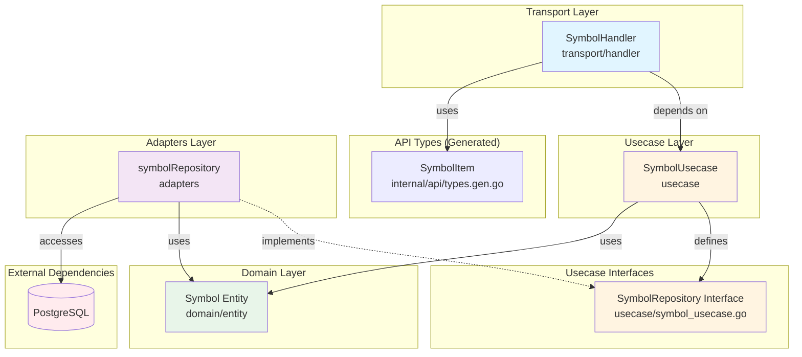

# Symbollistフィーチャー

## 概要

Symbollistフィーチャーは株式銘柄コードの管理機能を提供します。ユーザーがトラッキングできるアクティブな取引銘柄の一覧取得を処理します。

### 主な機能

- **アクティブ銘柄一覧**: トラッキング可能なすべてのアクティブな銘柄を取得
- **ソート済み結果**: 銘柄は `code` の昇順（アルファベット順）で返却
- **アクティブフィルタリング**: アクティブな銘柄（`is_active = true`）のみがクライアントに返却
- **ロゴ URL バッチ取り込み**: 外部 API（TwelveData）からロゴ URL を取得し `symbols.logo_url` を更新（[cmd/logo-ingest](../../../cmd/logo-ingest)）

## シーケンス図

### 銘柄一覧取得フロー


```mermaid
sequenceDiagram
    participant Client
    participant Handler as SymbolHandler
    participant Usecase as SymbolUsecase
    participant Repository as SymbolRepository
    participant DB as PostgreSQL

    Client->>Handler: GET /v1/symbols<br/>(Authorization: Bearer token)
    Handler->>Usecase: ListActiveSymbols(ctx)
    Usecase->>Repository: ListActive(ctx)
    Repository->>DB: SELECT * FROM symbols<br/>WHERE is_active = true<br/>ORDER BY code ASC
    DB-->>Repository: []Symbol
    Repository-->>Usecase: []Symbol
    Usecase-->>Handler: []Symbol
    Handler->>Handler: Convert to DTOs<br/>(code, name, logo_url)
    Handler-->>Client: 200 OK<br/>[{code, name, logo_url}, ...]

    alt Database Error
        DB-->>Repository: Error
        Repository-->>Usecase: Error
        Usecase-->>Handler: Error
        Handler-->>Client: 500 Internal Server Error
    end
```

## API仕様

### GET /v1/symbols

アクティブな株式銘柄の一覧を取得します。

**認証方式**（優先順位順）:
1. `auth_token` Cookie（ブラウザクライアント）+ `X-CSRF-Token` ヘッダー（必須）
2. `Authorization: Bearer <token>` ヘッダー（APIクライアント・curl等）

**レスポンス**

- **200 OK** - 成功
  ```json
  [
    {
      "code": "AAPL",
      "name": "Apple Inc.",
      "logo_url": "https://api.twelvedata.com/logo/apple.com"
    },
    {
      "code": "GOOGL",
      "name": "Alphabet Inc.",
      "logo_url": null
    },
    {
      "code": "MSFT",
      "name": "Microsoft Corporation",
      "logo_url": "https://api.twelvedata.com/logo/microsoft.com"
    }
  ]
  ```
  注: `logo_url` は未取得時 `null` を返します。

- **500 Internal Server Error** - データベースエラー
  ```json
  {
    "error": "database connection failed"
  }
  ```

## 依存関係図


```mermaid
graph TB
    subgraph "Transport Layer"
        Handler[SymbolHandler<br/>transport/handler]
    end

    subgraph "API Types (Generated)"
        APITypes[SymbolItem<br/>internal/api/types.gen.go]
    end

    subgraph "Usecase Layer"
        Usecase[SymbolUsecase<br/>usecase]
    end

    subgraph "Domain Layer"
        Entity[Symbol Entity<br/>domain/entity]
    end

    subgraph "Usecase Interfaces"
        RepoInterface[SymbolRepository Interface<br/>usecase/symbol_usecase.go]
    end

    subgraph "Adapters Layer"
        RepoImpl[symbolRepository<br/>adapters]
    end

    subgraph "External Dependencies"
        DB[(PostgreSQL)]
    end

    Handler -->|depends on| Usecase
    Handler -->|uses| APITypes
    Usecase -->|defines| RepoInterface
    Usecase -->|uses| Entity
    RepoImpl -.->|implements| RepoInterface
    RepoImpl -->|uses| Entity
    RepoImpl -->|accesses| DB

    style Handler fill:#e1f5ff
    style Usecase fill:#fff4e1
    style Entity fill:#e8f5e9
    style RepoInterface fill:#fff4e1
    style RepoImpl fill:#f3e5f5
    style DB fill:#ffebee
```

### 依存関係の説明

#### Transport層 ([transport/handler/symbol_handler.go](transport/handler/symbol_handler.go))
- **SymbolHandler**: HTTPリクエストを処理し、SymbolUsecaseを呼び出す
- **API型**（`internal/api/types.gen.go`）: OpenAPI仕様から自動生成された `api.SymbolItem` を使用

#### Usecase層
- **SymbolUsecase**（[usecase/symbol_usecase.go](usecase/symbol_usecase.go)）: 銘柄一覧取得のビジネスロジックを実装
  - `SymbolRepository` インターフェースを定義（`ListActive(ctx) ([]entity.Symbol, error)`）
- **LogoIngestUsecase**（[usecase/logo_url_ingest_usecase.go](usecase/logo_url_ingest_usecase.go)）: ロゴ URL バッチ取り込みのビジネスロジック
  - active 銘柄に対し外部 API でロゴ URL を取得し、`symbols.logo_url` / `logo_updated_at` を更新
  - 銘柄単位の失敗では処理を止めず、既存 `logo_url` も保持
  - レートリミッターで外部 API 呼び出しを制御
  - 結果は `LogoIngestResult{Total, Succeeded, Failed}` として返却
  - 以下のインターフェースを定義:
    - `LogoProvider`: 外部 API 抽象化（`GetLogoURL(ctx, symbol) (string, error)`）
    - `LogoSymbolRepository`: 銘柄リポジトリ（`ListActive`, `UpdateLogoURL`）

#### Domain層 ([domain/entity/symbol.go](domain/entity/symbol.go))
- **Symbolエンティティ**: 株式銘柄のドメインモデル。以下のフィールドを持つ:
  - `ID`: 主キー
  - `Code`: 一意の銘柄コード（例: "AAPL", "7203.T"）
  - `Name`: 企業名
  - `Market`: 市場識別子（例: "NASDAQ", "TSE"）
  - `Timezone`: 取引所の IANA タイムゾーン（例: "America/New_York", "Asia/Tokyo"）
  - `LogoURL`: TwelveData のロゴ URL（未取得時は `nil`）
  - `LogoUpdatedAt`: ロゴ URL を最後に取得・更新した日時
  - `IsActive`: トラッキング対象かどうか
  - `CreatedAt`: 登録日時
  - `UpdatedAt`: 最終更新日時

#### Adapters層 ([adapters/symbol_repository.go](adapters/symbol_repository.go))
- **symbolRepository**: sqlc + database/sql ベースのリポジトリ実装。`SymbolRepository` と `LogoSymbolRepository` の両インターフェースを満たす
  - `ListActive(ctx)`: コード昇順でアクティブな銘柄を返す
  - `UpdateLogoURL(ctx, code, logoURL, updatedAt)`: 指定銘柄のロゴ URL と取得日時を更新（対象行が無い場合は警告ログのみ）
  - `ListActiveCodes(ctx)`: アクティブな銘柄のコードのみを返す（補助メソッド）
  - `Exists(ctx, code)`: 指定コードの銘柄存在チェック

なお、candles フィーチャーの `IngestUsecase` が要求する `SymbolRepository`（`ListActiveSymbols(ctx) ([]ActiveSymbol, error)`）は、`internal/app/di/ingest_symbol.go` のアダプターで `symbolRepository.ListActive` の結果を変換することで満たしています。これによりフィーチャー間の直接依存を避けています。

### アーキテクチャ特性

1. **クリーンアーキテクチャ**: ドメイン層はインフラストラクチャ層から独立
2. **依存性逆転**: Usecaseは具象実装ではなくSymbolRepositoryインターフェースを定義・依存
3. **インターフェースの所有権**: リポジトリインターフェースは使用されるusecase層で定義（Goのベストプラクティス）
4. **DTO変換**: Handlerがドメインエンティティをクライアントに必要なフィールドのみ公開するDTOに変換

## ディレクトリ構成

```
symbollist/
├── README.md                              # このファイル
├── domain/
│   └── entity/
│       └── symbol.go                     # Symbolエンティティ定義
├── usecase/
│   ├── symbol_usecase.go                 # 一覧取得ロジック + SymbolRepositoryインターフェース
│   ├── symbol_usecase_test.go            # Usecaseテスト
│   ├── logo_url_ingest_usecase.go        # ロゴURLバッチ取り込み + LogoProvider/LogoSymbolRepositoryインターフェース
│   └── logo_url_ingest_usecase_test.go   # Logo Ingest Usecaseテスト
├── adapters/
│   ├── symbol_repository.go              # リポジトリ実装（SymbolRepository / LogoSymbolRepository）
│   └── symbol_repository_test.go         # リポジトリテスト
└── transport/
    └── handler/
        ├── symbol_handler.go             # HTTPハンドラー
        └── symbol_handler_test.go        # ハンドラーテスト
```

## テスト

symbollistフィーチャーのすべてのテストは、一貫性と保守性のために**テーブル駆動テストパターン**に従います。

### テスト構造とパターン

#### 全テスト共通のパターン

1. **テーブル駆動テスト**: すべてのテスト関数は構造体フィールドを持つ `tests` スライスを使用:
   - `name`: テストケースの説明（例: `"success: returns active symbols"`）
   - `wantErr`: エラーが期待されるかどうかのboolフラグ
   - 各テストタイプ固有の追加フィールド

2. **並列実行**: すべてのテストは `t.Parallel()` を使用して並行実行を有効化

3. **ヘルパー関数**: 各テストファイルにはコードの重複を削減するヘルパー関数を含む

#### Usecaseテスト ([usecase/symbol_usecase_test.go](usecase/symbol_usecase_test.go))

**モックリポジトリ**を使用してビジネスロジックを単体でテストします。

**実行コマンド:**
```bash
go test ./internal/feature/symbollist/usecase/... -v
```

#### Handlerテスト ([transport/handler/symbol_handler_test.go](transport/handler/symbol_handler_test.go))

**モックユースケース**を使用してHTTPリクエスト/レスポンス処理をテストします。

**実行コマンド:**
```bash
go test ./internal/feature/symbollist/transport/handler/... -v
```

#### リポジトリテスト ([adapters/symbol_repository_test.go](adapters/symbol_repository_test.go))

**インメモリSQLiteデータベース**を使用して結合テストを実施します。

**実行コマンド:**
```bash
go test ./internal/feature/symbollist/adapters/... -v
```

### 全テスト実行

```bash
go test ./internal/feature/symbollist/... -v -race -cover
```

## バッチ取り込みでの使用

### candles ingest からの利用

`symbolRepository.ListActive` は candles フィーチャーのバッチ取り込みプロセスでも使用され、どの銘柄の市場データを取得するかを決定します。

candles フィーチャーの `IngestUsecase` が定義する `SymbolRepository` インターフェースは以下のとおり、コード + タイムゾーンを返す形になっています:

```go
// candles/usecase/candle_ingest_usecase.go で定義
type SymbolRepository interface {
    ListActiveSymbols(ctx context.Context) ([]ActiveSymbol, error)
}
```

これに対し symbollist の `symbolRepository` は `ListActive(ctx) ([]entity.Symbol, error)` を提供しています。両者は `internal/app/di/ingest_symbol.go` のアダプターで橋渡しされ、フィーチャー間の直接依存を避けています。

### logo-ingest バッチ

[cmd/logo-ingest](../../../cmd/logo-ingest) は `LogoIngestUsecase` を起動し、active 銘柄の `logo_url` を外部 API（TwelveData）から取得して `symbols` テーブルに保存します。レートリミッターで外部 API 呼び出しを制御し、銘柄単位の失敗では中断せず処理を継続します。

管理者はデータベースの `is_active` を設定することで、アクティブにトラッキングする銘柄を制御できます。

## 今後の拡張予定

- 銘柄検索機能
- 銘柄カテゴリ/セクター
- 銘柄メタデータ（説明、業種など）
- 銘柄管理用の管理者エンドポイント（CRUD操作）
