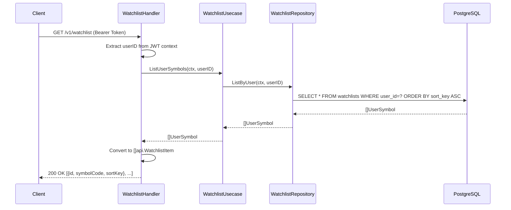
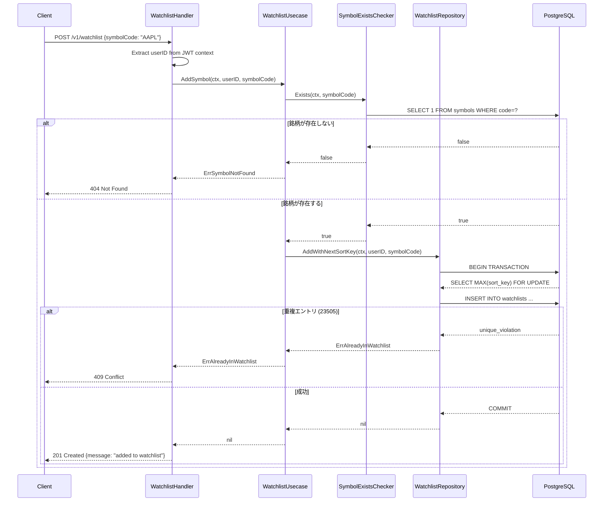
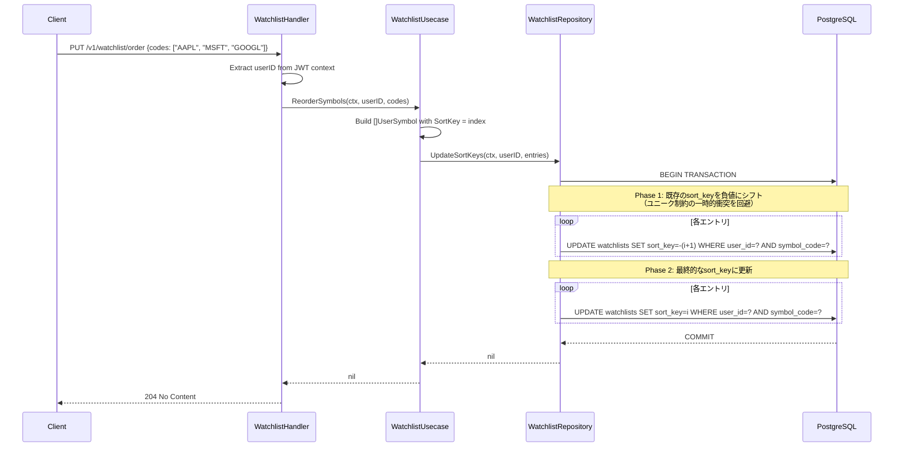

# Watchlist フィーチャー

## 概要

Watchlistフィーチャーは、ユーザーごとのウォッチリスト（お気に入り銘柄リスト）管理を提供します。銘柄の追加・削除・並び順変更を REST API 経由で操作できます。

### 主な機能

- **ウォッチリスト取得**: ログインユーザーの銘柄リストをソート順で返却
- **銘柄追加**: `symbols` テーブルに存在する銘柄のみ追加可（重複防止）
- **銘柄削除**: ウォッチリストから銘柄を削除
- **並び順変更**: ウォッチリストの表示順を一括更新
- **デフォルト銘柄初期化**: 新規ユーザーサインアップ時に AAPL/MSFT/GOOGL を自動追加

## シーケンス図

### ウォッチリスト取得フロー



### 銘柄追加フロー



### 並び順変更フロー



## API仕様

### GET /v1/watchlist

ログインユーザーのウォッチリストを `sort_key` 昇順で取得します。JWT認証が必要です。

**レスポンス**

- **200 OK** - 成功
  ```json
  [
    {"id": 1, "symbolCode": "AAPL", "sortKey": 0},
    {"id": 2, "symbolCode": "MSFT", "sortKey": 1},
    {"id": 3, "symbolCode": "GOOGL", "sortKey": 2}
  ]
  ```

---

### POST /v1/watchlist

ウォッチリストに銘柄を追加します。JWT認証が必要です。

**リクエストボディ**
```json
{"symbolCode": "AAPL"}
```

**レスポンス**

| ステータス | 説明 |
|-----------|------|
| 201 Created | 追加成功 `{"message": "added to watchlist"}` |
| 400 Bad Request | リクエストボディが不正 |
| 404 Not Found | `symbols` テーブルに存在しない銘柄コード |
| 409 Conflict | 既にウォッチリストに登録済みの銘柄 |
| 500 Internal Server Error | サーバー内部エラー |

---

### DELETE /v1/watchlist/:code

ウォッチリストから銘柄を削除します。JWT認証が必要です。

**パスパラメータ**
| パラメータ | 説明 | 例 |
|-----------|------|-----|
| `code` | 銘柄コード | `AAPL`, `7203.T` |

**レスポンス**

| ステータス | 説明 |
|-----------|------|
| 204 No Content | 削除成功 |
| 400 Bad Request | 銘柄コードが未指定 |
| 404 Not Found | ウォッチリストに存在しない銘柄 |
| 500 Internal Server Error | サーバー内部エラー |

---

### PUT /v1/watchlist/order

ウォッチリストの並び順を一括更新します。JWT認証が必要です。

**リクエストボディ**
```json
{"codes": ["AAPL", "MSFT", "GOOGL"]}
```
配列の順番が新しい `sort_key`（0始まりインデックス）として設定されます。

**レスポンス**

| ステータス | 説明 |
|-----------|------|
| 204 No Content | 更新成功 |
| 400 Bad Request | リクエストボディが不正 |
| 500 Internal Server Error | サーバー内部エラー |

## 依存関係図

```mermaid
graph TB
    subgraph "Transport Layer"
        Handler[WatchlistHandler<br/>transport/handler]
        UCInterface[WatchlistUsecase Interface<br/>transport/handler/watchlist_handler.go]
    end

    subgraph "API Types (Generated)"
        APITypes[WatchlistItem / AddWatchlistRequest<br/>ReorderWatchlistRequest<br/>internal/api/types.gen.go]
    end

    subgraph "Usecase Layer"
        WatchlistUC[WatchlistUsecase<br/>usecase/watchlist_usecase.go]
        RepoInterface[WatchlistRepository Interface<br/>usecase/watchlist_usecase.go]
        SymbolInterface[SymbolExistsChecker Interface<br/>usecase/watchlist_usecase.go]
        Errors[Domain Errors<br/>usecase/errors.go]
    end

    subgraph "Domain Layer"
        Entity[UserSymbol Entity<br/>domain/entity/user_symbol.go]
    end

    subgraph "Adapters Layer"
        RepoImpl[watchlistRepository<br/>adapters/watchlist_repository.go]
    end

    subgraph "External Feature (via Interface)"
        SymbolChecker[symbollist SymbolRepository<br/>（SymbolExistsCheckerを実装）]
    end

    subgraph "External Dependencies"
        DB[(PostgreSQL<br/>watchlists テーブル)]
    end

    Handler -->|depends on| UCInterface
    Handler -->|uses| APITypes
    Handler -->|uses| Errors
    WatchlistUC -.->|implements| UCInterface
    WatchlistUC -->|defines| RepoInterface
    WatchlistUC -->|defines| SymbolInterface
    WatchlistUC -->|uses| Entity
    WatchlistUC -->|uses| Errors
    RepoImpl -.->|implements| RepoInterface
    RepoImpl -->|uses| Entity
    RepoImpl -->|accesses| DB
    SymbolChecker -.->|implements| SymbolInterface

    style Handler fill:#e1f5ff
    style UCInterface fill:#e1f5ff
    style WatchlistUC fill:#fff4e1
    style RepoInterface fill:#fff4e1
    style SymbolInterface fill:#fff4e1
    style Errors fill:#fff4e1
    style Entity fill:#e8f5e9
    style RepoImpl fill:#f3e5f5
    style DB fill:#ffebee
    style SymbolChecker fill:#f3e5f5
```



### 依存関係の説明

#### トランスポート層（[transport/handler/watchlist_handler.go](transport/handler/watchlist_handler.go)）
- **WatchlistHandler**: HTTPリクエストを処理し、WatchlistUsecaseを呼び出す
- **WatchlistUsecase インターフェース**: transport層で定義（Goの「インターフェースは利用者が定義する」慣例）
- **API型**（`internal/api/types.gen.go`）: OpenAPI仕様から自動生成された `api.WatchlistItem` 等を使用

#### ユースケース層（[usecase/watchlist_usecase.go](usecase/watchlist_usecase.go)）
- **WatchlistUsecase**: ウォッチリスト操作のビジネスロジック
- **WatchlistRepository インターフェース**: 永続化層を抽象化（usecase層で定義）
- **SymbolExistsChecker インターフェース**: symbollist フィーチャーへの最小限の依存を表現。フィーチャー分離ルールに従い、symbollist の具体実装はインポートせずインターフェース経由で利用

#### ドメイン層（[domain/entity/user_symbol.go](domain/entity/user_symbol.go)）
- **UserSymbol**: `watchlists` テーブルにマップされるエンティティ
  - `UserID`: 所有ユーザーID（FK: users.id）
  - `SymbolCode`: 銘柄コード（FK: symbols.code、最大20文字）
  - `SortKey`: 表示順（ユーザー内でユニーク制約）
- ユニーク制約: `(user_id, symbol_code)` および `(user_id, sort_key)`

#### アダプター層（[adapters/watchlist_repository.go](adapters/watchlist_repository.go)）
- **watchlistRepository**: WatchlistRepositoryインターフェースのPostgreSQL実装
  - `ListByUser`: `sort_key ASC` 順でリスト返却
  - `Add`: エントリ追加（PostgreSQLエラーコードで `ErrAlreadyInWatchlist` / `ErrSymbolNotFound` に変換）
  - `AddWithNextSortKey`: `SELECT MAX(sort_key) FOR UPDATE` + INSERT をトランザクション内で実行（並行追加時の重複順位防止）
  - `Remove`: 削除（`RowsAffected == 0` の場合 `ErrNotInWatchlist` を返す）
  - `UpdateSortKeys`: 2フェーズ更新でユニーク制約衝突を回避（負値シフト→最終値）

### アーキテクチャの特徴

1. **クリーンアーキテクチャ**: ドメイン層がインフラストラクチャから独立
2. **インターフェース所有権**: `WatchlistRepository` は usecase 層で定義、`WatchlistUsecase` は transport 層で定義
3. **フィーチャー分離**: `SymbolExistsChecker` 最小インターフェースにより symbollist への直接依存を回避
4. **並行安全**: `AddWithNextSortKey` でトランザクション + `FOR UPDATE` により重複 sort_key を防止
5. **2フェーズ sort_key 更新**: ユニーク制約を一時的に違反しないよう、負値シフト後に最終値を設定

## ディレクトリ構成

```
watchlist/
├── README.md                         # 本ファイル
├── domain/
│   └── entity/
│       └── user_symbol.go            # UserSymbol エンティティ
├── usecase/
│   ├── watchlist_usecase.go          # ビジネスロジック + WatchlistRepository / SymbolExistsChecker インターフェース
│   └── errors.go                     # ErrSymbolNotFound / ErrAlreadyInWatchlist / ErrNotInWatchlist
├── adapters/
│   └── watchlist_repository.go       # WatchlistRepository の PostgreSQL 実装
└── transport/
    └── handler/
        └── watchlist_handler.go      # HTTPハンドラー + WatchlistUsecase インターフェース
```

## テスト

現在テストファイルは未作成です。以下の方針でテストを追加することを推奨します。

### 推奨テスト構造

#### ユースケーステスト（`usecase/watchlist_usecase_test.go`）
モックリポジトリとモック SymbolExistsChecker を使用してビジネスロジックをテスト。

- `TestWatchlistUsecase_ListUserSymbols`: リスト取得の正常系・エラー系
- `TestWatchlistUsecase_AddSymbol`: 銘柄存在確認・追加成功・ErrSymbolNotFound・ErrAlreadyInWatchlist
- `TestWatchlistUsecase_RemoveSymbol`: 削除成功・ErrNotInWatchlist
- `TestWatchlistUsecase_ReorderSymbols`: 並び順更新の正常系・エラー系

#### ハンドラーテスト（`transport/handler/watchlist_handler_test.go`）
モックユースケースを使用して HTTP リクエスト/レスポンスをテスト。

- 各エンドポイントの HTTP ステータスコード検証
- エラーケース（404/409/500）のレスポンスボディ検証

#### リポジトリテスト（`adapters/watchlist_repository_test.go`）
インメモリ SQLite を使用した統合テスト。

- `AddWithNextSortKey` の並行安全性テスト
- `UpdateSortKeys` の 2フェーズ更新テスト
- 重複追加・存在しない銘柄削除のエラー変換テスト

### テスト実行コマンド

```bash
# watchlist フィーチャー全テスト
go test ./internal/feature/watchlist/... -v -race -cover
```
