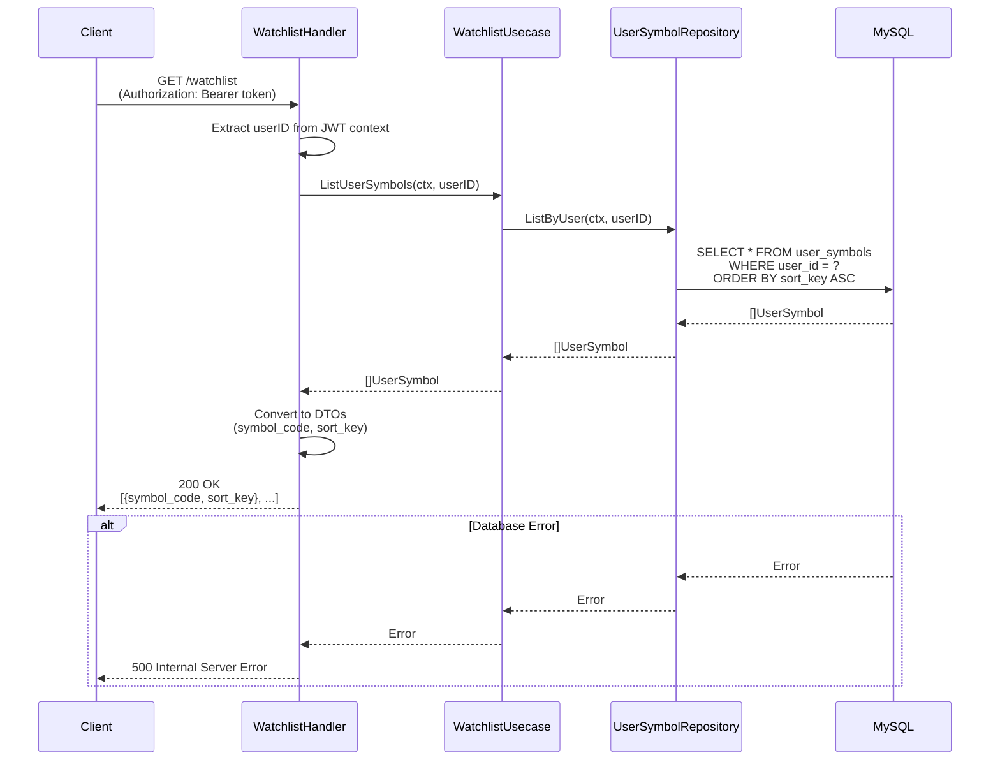
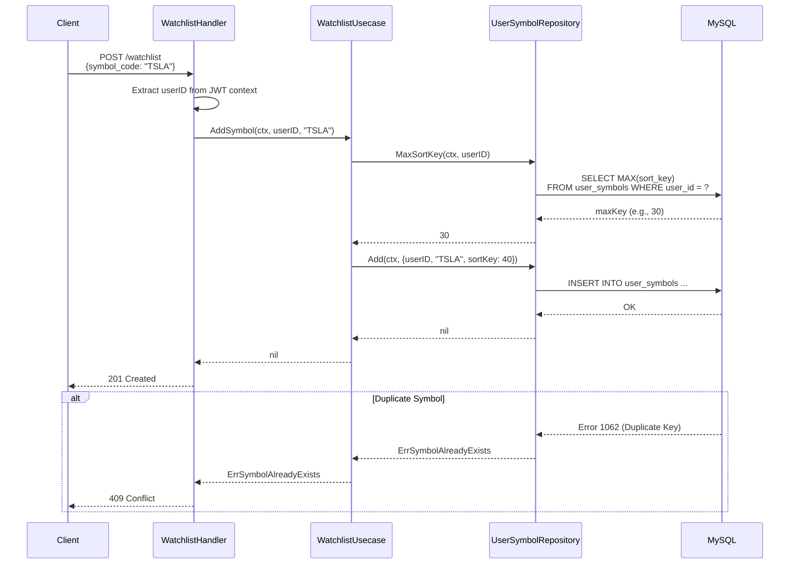
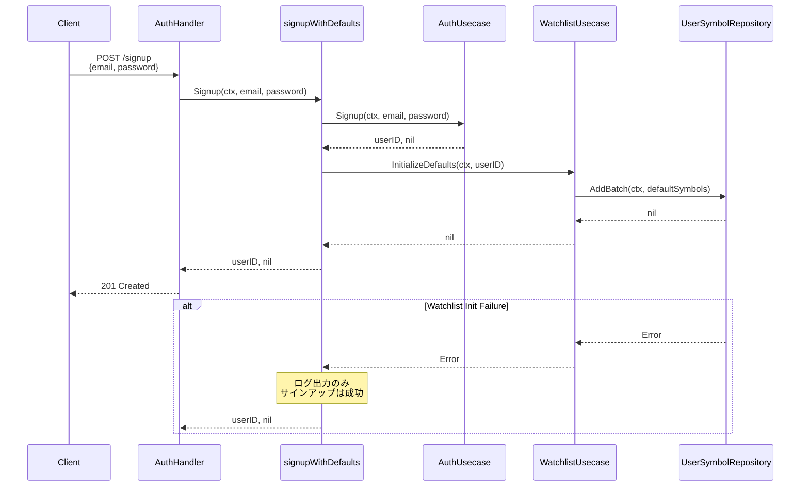
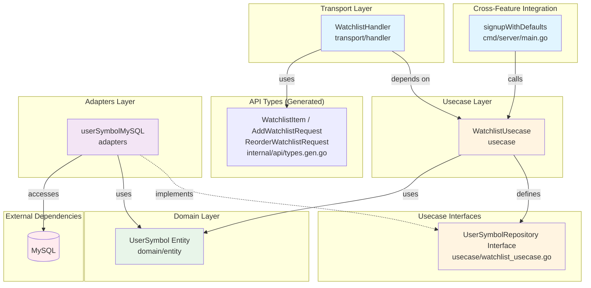

# Watchlistフィーチャー

## 概要

Watchlistフィーチャーはユーザー固有の銘柄ウォッチリスト管理機能を提供します。各ユーザーが独自の銘柄リストを作成・管理でき、マスタテーブル（`symbols`）に存在しない銘柄も自由に追加できます。

### 主な機能

- **ウォッチリスト取得**: ユーザーのウォッチリスト銘柄をソート順に取得
- **銘柄追加**: 任意の銘柄コードをウォッチリストに追加（マスタ外の銘柄も可）
- **銘柄削除**: ウォッチリストから銘柄を削除
- **並び順カスタマイズ**: ユーザーごとに銘柄の表示順序を自由に変更
- **デフォルト銘柄**: 新規ユーザー登録時にデフォルト銘柄（AAPL, MSFT, GOOGL）を自動追加

## シーケンス図

### ウォッチリスト取得フロー



### 銘柄追加フロー



### サインアップ時のデフォルト銘柄初期化フロー



## API仕様

### GET /watchlist

ユーザーのウォッチリスト銘柄一覧を取得します。

**認証**: 必須（JWT Bearerトークン）

**レスポンス**

- **200 OK** - 成功

  ```json
  [
    {
      "symbol_code": "AAPL",
      "sort_key": 10
    },
    {
      "symbol_code": "MSFT",
      "sort_key": 20
    },
    {
      "symbol_code": "GOOGL",
      "sort_key": 30
    }
  ]
  ```

- **500 Internal Server Error** - サーバーエラー

  ```json
  {
    "error": "failed to get watchlist"
  }
  ```

### POST /watchlist

ウォッチリストに銘柄を追加します。`sort_key` は自動的に末尾に設定されます。

**認証**: 必須（JWT Bearerトークン）

**リクエストボディ**

```json
{
  "symbol_code": "TSLA"
}
```

**レスポンス**

- **201 Created** - 追加成功

  ```json
  {
    "message": "ok"
  }
  ```

- **400 Bad Request** - バリデーションエラー

  ```json
  {
    "error": "invalid request"
  }
  ```

- **409 Conflict** - 既に登録済み

  ```json
  {
    "error": "symbol already exists in watchlist"
  }
  ```

### DELETE /watchlist/:code

ウォッチリストから銘柄を削除します。

**認証**: 必須（JWT Bearerトークン）

**パスパラメータ**

| パラメータ | 型     | 説明                           |
| ---------- | ------ | ------------------------------ |
| code       | string | 銘柄コード（例: AAPL, 7203.T） |

**レスポンス**

- **204 No Content** - 削除成功

- **404 Not Found** - 銘柄が見つからない

  ```json
  {
    "error": "symbol not found in watchlist"
  }
  ```

### PUT /watchlist/order

ウォッチリストの並び順を更新します。

**認証**: 必須（JWT Bearerトークン）

**リクエストボディ**

```json
{
  "symbol_codes": ["MSFT", "AAPL", "GOOGL"]
}
```

各銘柄の `sort_key` は配列のインデックス × 10 で自動設定されます（上記例: MSFT=0, AAPL=10, GOOGL=20）。

**レスポンス**

- **200 OK** - 更新成功

  ```json
  {
    "message": "ok"
  }
  ```

- **400 Bad Request** - バリデーションエラー

  ```json
  {
    "error": "invalid request"
  }
  ```

## 依存関係図



### 依存関係の説明

#### Transport層 ([transport/handler/watchlist_handler.go](transport/handler/watchlist_handler.go))

- **WatchlistHandler**: HTTPリクエストを処理し、WatchlistUsecaseを呼び出す
- **API型**（`internal/api/types.gen.go`）: OpenAPI仕様から自動生成された `api.WatchlistItem`、`api.AddWatchlistRequest`、`api.ReorderWatchlistRequest` を使用
- JWTコンテキストから `userID` を取得（`c.MustGet(jwtmw.ContextUserID).(uint)`）

#### Usecase層 ([usecase/watchlist_usecase.go](usecase/watchlist_usecase.go))

- **WatchlistUsecase**: ウォッチリスト操作のビジネスロジックを実装
  - UserSymbolRepositoryインターフェースを定義（Goの「インターフェースは利用者が定義する」慣例に従う）
- **UserSymbolRepositoryインターフェース**: リポジトリインターフェース:
  - `ListByUser(ctx, userID)`: ユーザーのウォッチリスト銘柄をsort_key順に返す
  - `Add(ctx, userSymbol)`: 銘柄を追加
  - `Remove(ctx, userID, symbolCode)`: 銘柄を削除
  - `UpdateSortKeys(ctx, userID, codeOrder)`: 並び順を一括更新
  - `AddBatch(ctx, userSymbols)`: 複数銘柄を一括追加（デフォルト銘柄用）
  - `MaxSortKey(ctx, userID)`: 最大sort_keyを取得

#### Domain層 ([domain/entity/user_symbol.go](domain/entity/user_symbol.go))

- **UserSymbolエンティティ**: ユーザー固有のウォッチリスト銘柄のドメインモデル。以下のフィールドを持つ:
  - `ID`: 主キー
  - `UserID`: ユーザーID（`users.id` へのFK）
  - `SymbolCode`: 銘柄コード（例: "AAPL"、マスタ外も可）
  - `SortKey`: ユーザー固有の表示順序
  - `CreatedAt`: 作成日時
  - `UpdatedAt`: 最終更新日時

#### Adapters層 ([adapters/user_symbol_mysql.go](adapters/user_symbol_mysql.go))

- **userSymbolMySQL**: UserSymbolRepositoryのMySQL実装（GORMを使用）
  - MySQL error 1062（重複キー）を `ErrSymbolAlreadyExists` にマッピング
  - `AddBatch`: 重複は無視して冪等性を保証
  - `UpdateSortKeys`: トランザクション内で一括更新

### アーキテクチャ特性

1. **クリーンアーキテクチャ**: ドメイン層はインフラストラクチャ層から独立
2. **依存性逆転**: Usecaseは具象実装ではなくUserSymbolRepositoryインターフェースを定義・依存
3. **フィーチャー分離**: watchlistフィーチャーは他のフィーチャー（auth, candles, symbollist）を直接インポートしない
4. **クロスフィーチャー統合**: サインアップ時のデフォルト銘柄初期化は `cmd/server/main.go` の `signupWithDefaults` ラッパーで実現（フィーチャー間の直接依存を回避）

## データベーススキーマ

### user_symbols テーブル

| カラム       | 型                    | 制約                                            |
| ------------ | --------------------- | ------------------------------------------------|
| id           | BIGINT UNSIGNED       | PRIMARY KEY, AUTO_INCREMENT                     |
| user_id      | BIGINT UNSIGNED       | NOT NULL, FK → users(id) ON DELETE CASCADE      |
| symbol_code  | VARCHAR(20)           | NOT NULL                                        |
| sort_key     | INT                   | NOT NULL, DEFAULT 0                             |
| created_at   | DATETIME(3)           | NOT NULL                                        |
| updated_at   | DATETIME(3)           | NOT NULL                                        |

**インデックス**:

- `uk_user_symbol (user_id, symbol_code)` - ユニーク制約（ユーザーごとの重複防止）
- `idx_user_symbols_user_sort (user_id, sort_key)` - ソート付き取得の高速化

**設計ポイント**: `symbols` テーブルへの外部キーは設定していません。これにより、マスタテーブルに存在しない銘柄コードも自由にウォッチリストに追加できます。

## ディレクトリ構成

```text
watchlist/
├── README.md                          # このファイル
├── domain/
│   └── entity/
│       └── user_symbol.go            # UserSymbolエンティティ定義
├── usecase/
│   ├── errors.go                     # センチネルエラー定義
│   ├── watchlist_usecase.go          # ビジネスロジック + UserSymbolRepositoryインターフェース
│   └── watchlist_usecase_test.go     # Usecaseテスト
├── adapters/
│   └── user_symbol_mysql.go          # MySQLリポジトリ実装
└── transport/
    └── handler/
        ├── watchlist_handler.go      # HTTPハンドラー
        └── watchlist_handler_test.go # ハンドラーテスト
```

## テスト

watchlistフィーチャーのすべてのテストは、一貫性と保守性のために**テーブル駆動テストパターン**に従います。

### テスト構造とパターン

#### 全テスト共通のパターン

1. **テーブル駆動テスト**: すべてのテスト関数は構造体フィールドを持つ `tests` スライスを使用:
   - `name`: テストケースの説明（例: `"success: add symbol"`）
   - `wantErr`: エラーが期待されるかどうかのboolフラグ
   - 各テストタイプ固有の追加フィールド

2. **並列実行**: すべてのテストは `t.Parallel()` を使用して並行実行を有効化

3. **モックリポジトリ**: 関数フィールドベースのモック実装でリポジトリの各メソッドをシミュレート

#### Usecaseテスト ([usecase/watchlist_usecase_test.go](usecase/watchlist_usecase_test.go))

**モックリポジトリ**を使用してビジネスロジックを単体でテストします。

テストケース:

- `ListUserSymbols`: 銘柄一覧取得、空リスト、リポジトリエラー
- `AddSymbol`: 追加成功、空コード、重複エラー
- `RemoveSymbol`: 削除成功、存在しない銘柄
- `ReorderSymbols`: 並び順更新、空リスト、リポジトリエラー
- `InitializeDefaults`: デフォルト銘柄作成、リポジトリエラー

**実行コマンド:**

```bash
go test ./internal/feature/watchlist/usecase/... -v
```

#### Handlerテスト ([transport/handler/watchlist_handler_test.go](transport/handler/watchlist_handler_test.go))

**モックユースケース**を使用してHTTPリクエスト/レスポンス処理をテストします。JWTコンテキストはミドルウェアのモックでセットアップします。

テストケース:

- `List`: 一覧取得成功、空リスト、ユースケースエラー
- `Add`: 追加成功、バリデーションエラー、重複（409）、サーバーエラー
- `Remove`: 削除成功、存在しない銘柄（404）
- `Reorder`: 並び順更新成功、バリデーションエラー、サーバーエラー

**実行コマンド:**

```bash
go test ./internal/feature/watchlist/transport/handler/... -v
```

### 全テスト実行

```bash
go test ./internal/feature/watchlist/... -v -race -cover
```

## symbollistフィーチャーとの関係

| 項目         | symbollist（マスタ）                    | watchlist（ユーザー）                   |
| ------------ | --------------------------------------- | --------------------------------------- |
| テーブル     | `symbols`                               | `user_symbols`                          |
| 用途         | バッチ取り込み対象の銘柄管理            | ユーザー個別の銘柄リスト管理            |
| データ所有者 | システム管理者                          | 各ユーザー                              |
| 銘柄制限     | 管理者が `is_active` で制御             | 任意の銘柄コードを自由に追加可能        |
| 並び順       | 全ユーザー共通の `sort_key`             | ユーザーごとに独立した `sort_key`       |
| API          | `GET /v1/symbols`                       | `GET/POST/DELETE/PUT /v1/watchlist`     |
